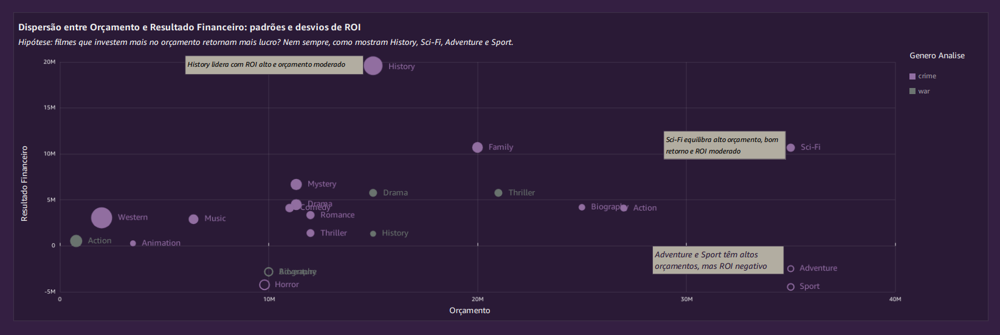
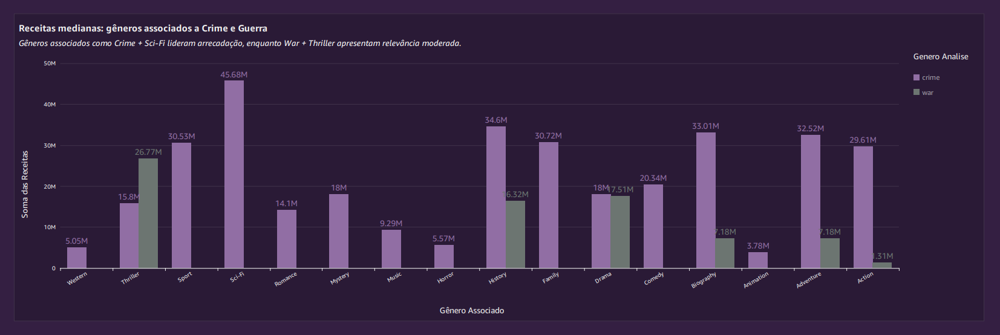
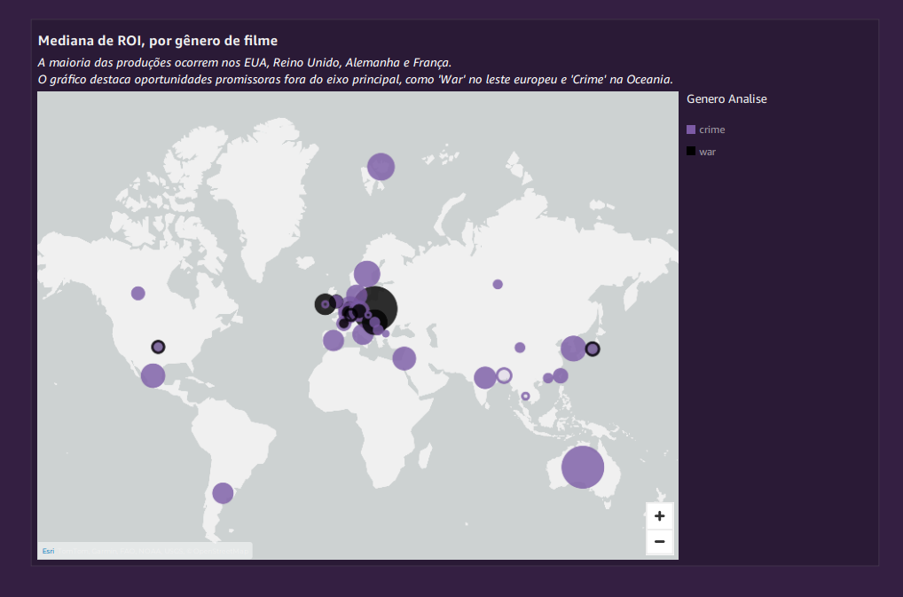

   

# Análise Estratégica de Filmes: Decifrando o ROI e as Tendências de Mercado na AWS

Este projeto apresenta uma **análise de ponta a ponta sobre o desempenho financeiro e de mercado de filmes dos gêneros Crime e Guerra** (e seus sub-gêneros associados), transformando um desafio de negócio complexo em **recomendações estratégicas e acionáveis**. A análise foi sustentada pela construção de um **Data Lake serverless na AWS**, demonstrando um fluxo de trabalho completo que vai da engenharia robusta à geração de insights de alto valor para a tomada de decisão. A investigação culmina em um relatório executivo que responde a questões críticas sobre otimização de orçamento, potencial de franquias e oportunidades de mercado.

<br>

## 💥 O Problema de Negócio

Um estúdio de cinema fictício precisa de direcionamento estratégico para futuros investimentos. Para isso, era necessário responder a perguntas críticas sobre o desempenho histórico de filmes de Crime e Guerra, envolvendo performance financeira (ROI, Receita), popularidade, impacto de franquias e tendências de mercado.

---

## 📈 Principais Resultados e Análises

A análise dos dados, consolidada em um relatório executivo, revelou padrões claros e permitiu a formulação de diretrizes estratégicas para o estúdio. O projeto completo pode ser acessado abaixo, seguido dos destaques visuais.

**[Acesse o Relatório Executivo completo em PDF aqui](./Sprint10/desafio/relatorio/Felipe.Reis-Relatório-Dashboard-Sprint10.pdf)**

---

### Destaques da Análise

#### 1. Dispersão entre Orçamento e Resultado Financeiro: padrões e desvios de ROI
*A análise mostra que a hipótese de que orçamentos maiores garantem lucros maiores nem sempre é verdadeira. Gêneros como `History` e `Sci-Fi` demonstram um equilíbrio interessante, com `History` apresentando alto ROI com orçamentos moderados. Em contraste, `Adventure` e `Sport` mostram alto investimento com ROI negativo, indicando maior risco.*



#### 2. Receitas medianas: gêneros associados a Crime e Guerra
*Ao analisar as receitas medianas, a combinação de `Crime` com `Sci-Fi` se destaca como a mais lucrativa. `War` combinado com `Thriller` também mostra relevância. Este gráfico é fundamental para identificar nichos de mercado e combinações de gênero com maior potencial de arrecadação.*



#### 3. Análise Geográfica: Mediana de ROI, por gênero de filme
*Embora a maior parte da produção se concentre no eixo EUA-Europa, a análise de ROI por localização geográfica destaca oportunidades promissoras fora do eixo principal. Produções de `War` no Leste Europeu e de `Crime` na Oceania, por exemplo, apresentam um ROI mediano interessante, sugerindo mercados com potencial a ser explorado.*



---

### Recomendações Estratégicas Acionáveis:
* **Otimização de Orçamento:** Filmes com orçamentos moderados (entre $20M e $60M) apresentaram o maior Retorno Sobre o Investimento (ROI), sugerindo um "ponto ótimo" para investimentos futuros, especialmente em gêneros como `History`.
* **Potencial de Franquias:** Franquias demonstraram ser significativamente mais lucrativas que filmes únicos. A análise temporal sugere que o sucesso é maior quando o intervalo entre lançamentos é inferior a 4 anos, indicando a importância de um planejamento de ciclo de vida.
* **Exploração de Nichos e Mercados:** A combinação de gêneros como `Crime` com `Sci-Fi` ou `History` apresenta alto potencial financeiro. Adicionalmente, mercados fora do eixo tradicional (EUA, Europa Ocidental) como o Leste Europeu e a Oceania mostram oportunidades de ROI promissoras que merecem uma análise de investimento.

---

## 🎯 A Solução: Análise de Ponta a Ponta

Para entregar esses insights, foi construído um **Data Lake serverless de ponta a ponta na AWS**. A solução completa envolve um pipeline automatizado que ingere dados de fontes diversas, os processa e modela em um esquema dimensional robusto, e os disponibiliza para análise em um relatório no Amazon QuickSight.

---

## 🏗️ A Engenharia por Trás da Análise: Arquitetura do Pipeline

A análise foi sustentada por uma arquitetura de dados serverless, garantindo escalabilidade, automação e baixo custo operacional.

**Fluxo de Dados:**
`Fontes (CSV/API) -> S3 (Raw) -> AWS Glue (PySpark) -> S3 (Trusted) -> AWS Glue (PySpark) -> S3 (Refined) -> Athena -> QuickSight`

*Insira aqui o diagrama da arquitetura. Ferramentas como draw.io ou Miro são ótimas para isso.*
``

---

## 🛠️ Tecnologias Utilizadas

* **Cloud & ETL:** AWS S3, AWS Glue, AWS Lambda, AWS EventBridge, AWS Athena
* **Processamento de Dados:** Apache Spark (PySpark)
* **Visualização (BI):** Amazon QuickSight
* **Linguagem & Bibliotecas:** Python (Pandas, Boto3, Requests)
* **Containerização:** Docker
* **Automação e Ambiente:** Shell Script, Linux

---

## 🛣️ Etapas do Pipeline de Dados

O desenvolvimento do Data Lake seguiu um processo estruturado, desde a ingestão dos dados brutos até a camada de apresentação.

* **1. Ingestão Automatizada na Camada Raw:** O pipeline inicia com a ingestão dos dados brutos (CSV do IMDB e JSON da API do TMDB) na camada `Raw` do S3. Scripts em Python com Boto3 foram usados para automatizar o provisionamento de buckets e o upload dos dados em uma estrutura particionada por data. Todo o processo foi containerizado com **Docker** para assegurar a reprodutibilidade.

* **2. Enriquecimento de Dados via API com Pipeline Serverless:** Para enriquecer os dados, foi construído um pipeline de ingestão serverless com **AWS Lambda** para extrair informações da API do TMDB. A orquestração foi feita com **AWS EventBridge**, que agendou execuções parametrizadas para lidar com os limites da API e o timeout da Lambda de forma resiliente.

* **3. Construção da Camada Trusted com AWS Glue:** Os dados da camada `Raw` foram processados por Jobs no **AWS Glue** utilizando **PySpark**. Foram aplicadas regras de negócio como limpeza de nulos, padronização de campos e definição de schemas para garantir a consistência. Os dados tratados foram salvos em formato **Parquet** na camada `Trusted`.

* **4. Construção da Camada Refined e Modelagem Dimensional:** Na etapa final de engenharia, os dados da camada `Trusted` foram unidos, enriquecidos com campos calculados de negócio (como ROI) e modelados em um **esquema Galaxy com tabelas ponte**. Esta modelagem avançada foi necessária para garantir a precisão das análises com relacionamentos complexos, com a integridade validada via **AWS Athena**.

* **5. Visualização e Storytelling com Amazon QuickSight:** Os dados da camada `Refined` foram consumidos pelo **Amazon QuickSight** para a construção de um relatório executivo. O design foi focado em **storytelling com dados**, apresentando as análises de forma contextualizada para culminar nas conclusões e recomendações acionáveis.

---

## 🚀 Como Executar o Projeto

Para replicar o ambiente de desenvolvimento e execução dos scripts locais:

1.  **Clone o repositório:**
    ```bash
    git clone [https://github.com/felipecsr/analise-desempenho-filmes-aws.git](https://github.com/felipecsr/analise-desempenho-filmes-aws.git)
    cd analise-desempenho-filmes-aws
    ```
    *(Lembre-se de ajustar a URL acima após renomear seu repositório)*

2.  **Configure suas credenciais AWS:**
    Certifique-se de que suas credenciais da AWS estejam configuradas no ambiente (via `aws configure` ou variáveis de ambiente).

3.  **Instale as dependências:**
    ```bash
    pip install -r requirements.txt
    ```
    *Nota: Um arquivo `requirements.txt` é fornecido para documentar as bibliotecas Python utilizadas nos scripts locais, garantindo a reprodutibilidade do ambiente.*

4.  **Execute os scripts e Jobs:**
    Siga as instruções detalhadas nos READMEs de cada sprint para executar os scripts locais e configurar os Jobs no AWS Glue.

---

## 📂 Detalhes do Desenvolvimento (Sprints)

Este projeto foi o desafio final de um programa de bolsas de 20 semanas em Data & Analytics na AWS. As 5 etapas finais focaram na construção deste pipeline, enquanto as 5 etapas iniciais consolidaram os fundamentos técnicos necessários para sua execução.

#### Fundamentos Técnicos (Sprints 1-5)
As sprints iniciais focaram no desenvolvimento de competências fundamentais em engenharia e análise de dados, incluindo **Linux & Shell Script, modelagem de dados com SQL, ETL e análise com Python & Pandas, e containerização com Docker**, que formaram a base para a execução deste projeto.

#### Etapas de Construção do Projeto (Sprints 6-10)
O "diário de bordo" detalhado, com códigos, desafios e aprendizados de cada fase da construção do Data Lake, pode ser encontrado nos links abaixo:

* [**Sprint 06:** Definição do Escopo e Ingestão Inicial no S3](./Sprint06/Desafio/README.md)
* [**Sprint 07:** Extração de Dados via API com Lambda e EventBridge](./Sprint07/Desafio/README.md)
* [**Sprint 08:** Construção da Camada Trusted com AWS Glue e PySpark](./Sprint08/desafio/README.md)
* [**Sprint 09:** Modelagem Dimensional e Construção da Camada Refined](./Sprint09/desafio/README.md)
* [**Sprint 10:** Visualização de Dados com QuickSight e Finalização](./Sprint10/desafio/README.md)

