# 💻 Exercícios

Nesta Sprint 02, tivemos diversos exercícios e os resultados esperados são os 'códigos' SQL, que seguem abaixo:

1.  [Consulta exercício 1](exercicios/ex01/ex1.sql)  
2.  [Consulta exercício 2](exercicios/ex02/ex2.sql)  
3.  [Consulta exercício 3](exercicios/ex03/ex3.sql)  
4.  [Consulta exercício 4](exercicios/ex04/ex4.sql)  
5.  [Consulta exercício 5](exercicios/ex05/ex5.sql)  
6.  [Consulta exercício 6](exercicios/ex06/ex6.sql)  
7.  [Consulta exercício 7](exercicios/ex07/ex7.sql)  
8.  [Consulta exercício 8](exercicios/ex08/ex8.sql)  
9.  [Consulta exercício 9](exercicios/ex09/ex9.sql)  
10. [Consulta exercício 10](exercicios/ex10/ex10.sql)  
11. [Consulta exercício 11](exercicios/ex11/ex11.sql)  
12. [Consulta exercício 12](exercicios/ex12/ex12.sql)  
13. [Consulta exercício 13](exercicios/ex13/ex13.sql)  
14. [Consulta exercício 14](exercicios/ex14/ex14.sql)  
15. [Consulta exercício 15](exercicios/ex15/ex15.sql)  
16. [Consulta exercício 16](exercicios/ex16/ex16.sql)  
    
    

# 📷 Evidências

Aqui abaixo seguem as evidências relacionadas aos exercícios 1 ao 16:

1. Sucesso na query do exercício 1 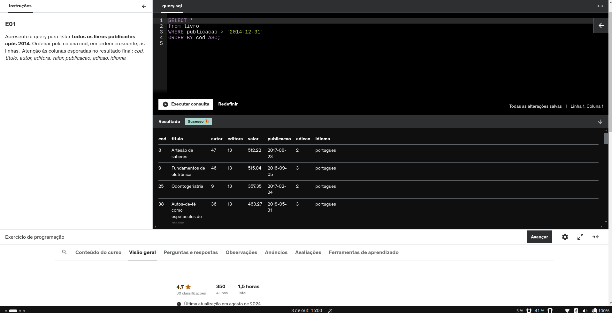    

2. Sucesso na query do exercício 2  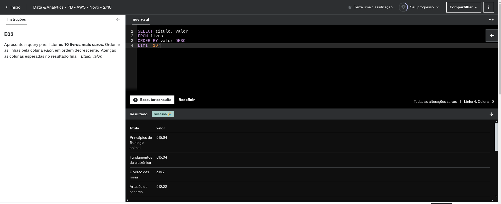    

3. Sucesso na query do exercício 3  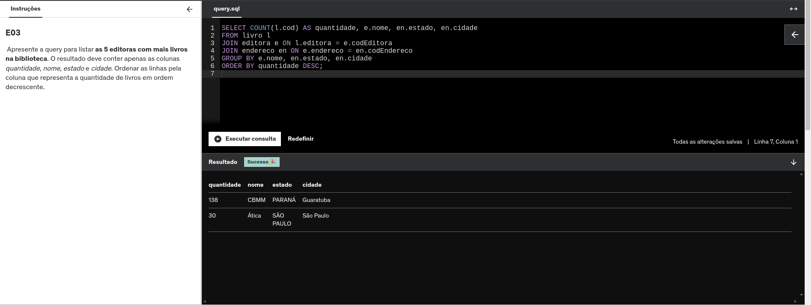    

4. Sucesso na query do exercício 4  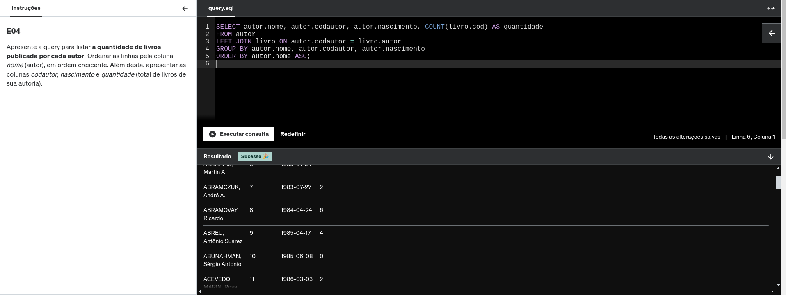    

5. Sucesso na query do exercício 5  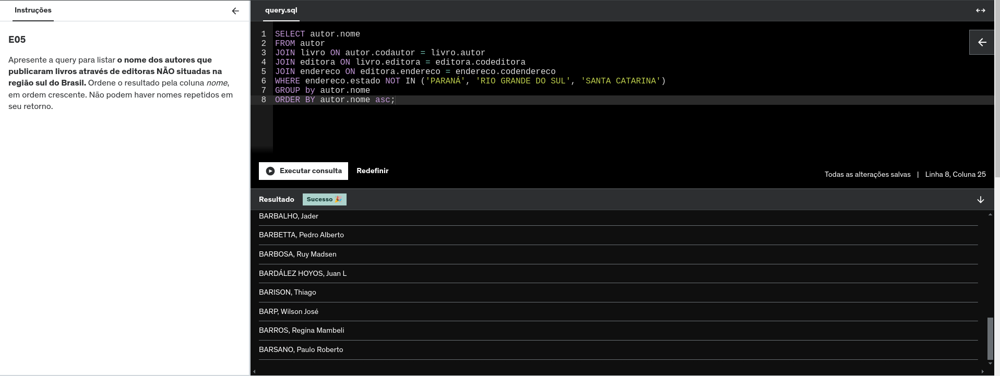    

6. Sucesso na query do exercício 6  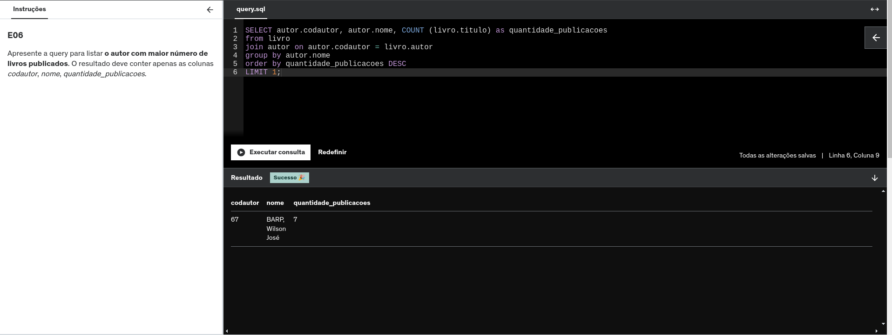   

7. Sucesso na query do exercício 7  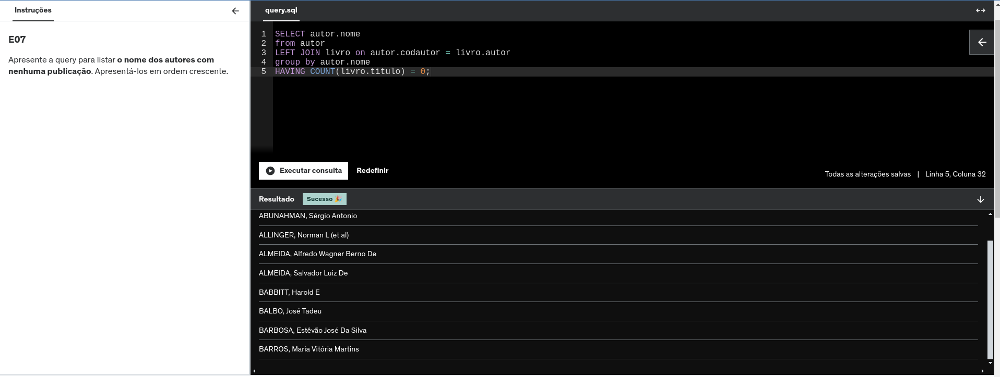    

8. Sucesso na query do exercício 8    

9. Sucesso na query do exercício 9  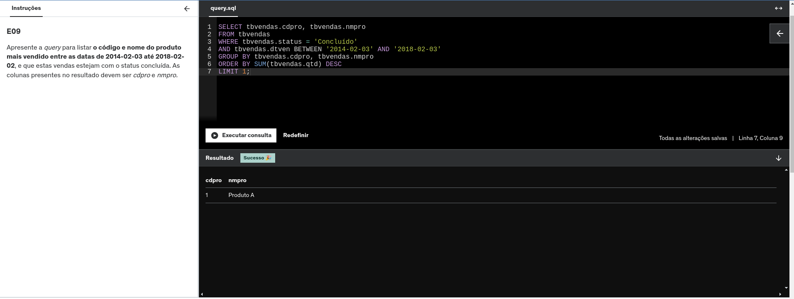   

10. Sucesso na query do exercício 10 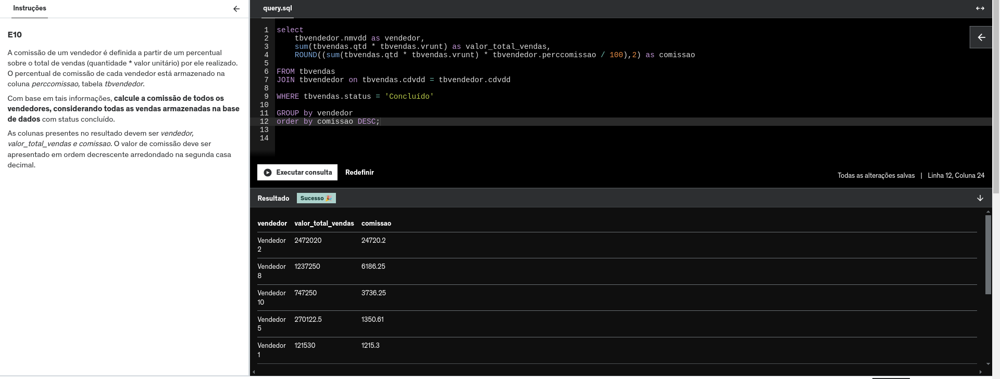  

11. Sucesso na query do exercício 11 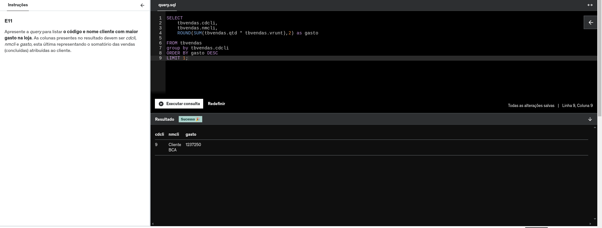  

12. Sucesso na query do exercício 12 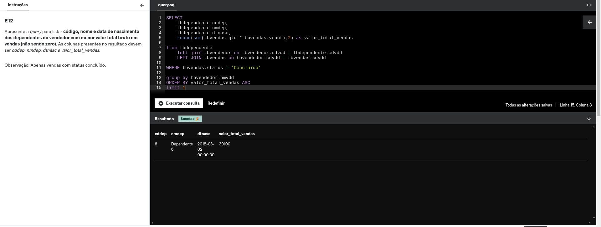  

13. Sucesso na query do exercício 13   

14. Sucesso na query do exercício 14 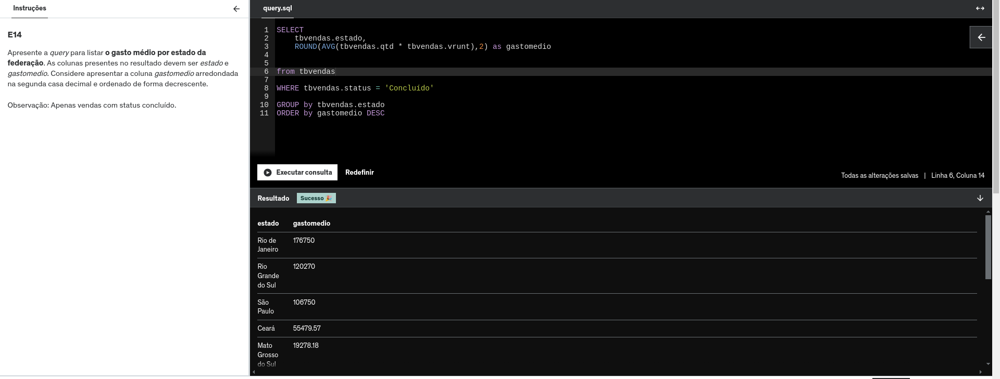  

15. Sucesso na query do exercício 15 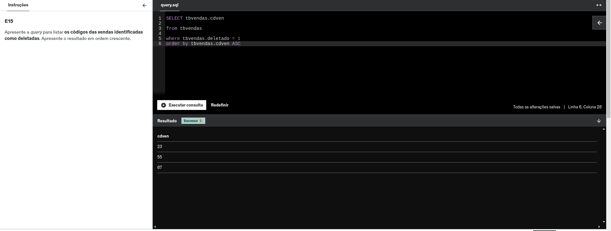  

16. Sucesso na query do exercício 16 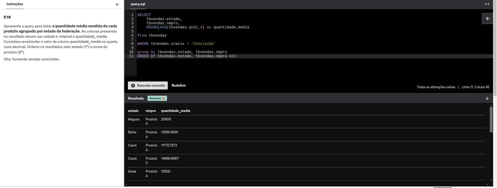  
  
  
# 📜 Certificados

- [SQL para Análise de Dados: do básico ao avançado](certificados/SQL.png)

- [AWS Skill Builder: Sales Accreditation](certificados/AWS.png)
  
  
# 🧠 Desafio
**Structured Consulta Language (SQL)**  
Nesta segunda sprint, aprendi e pratiquei SQL. Realizei práticas de consultas e aprofundei a compreensão sobre estruturas de bancos de dados, além de analisar as vantagens e desvantagens de diferentes modelagens e abordagens de tratamento, tanto antes quanto depois do carregamento dos dados.

Fiquei satisfeito por ter conseguido avançar rapidamente nesta sprint, pois já tinha uma experiência básica com SQL antes do programa de bolsas. Fiquei atento às sintaxes e tenho a certeza de que apenas a prática constante trará fluência e agilidade.

Durante esse percurso, também refleti sobre como poderia e deveria ter me dedicado ao aprendizado de SQL anteriormente na minha carreira. Teria sido útil em diversas empresas e momentos pelos quais passei! É um misto de arrependimento, mas com a sensação de missão cumprida! 💪

[Confira o 'readme' do desafio aqui!](Desafio/README.md)