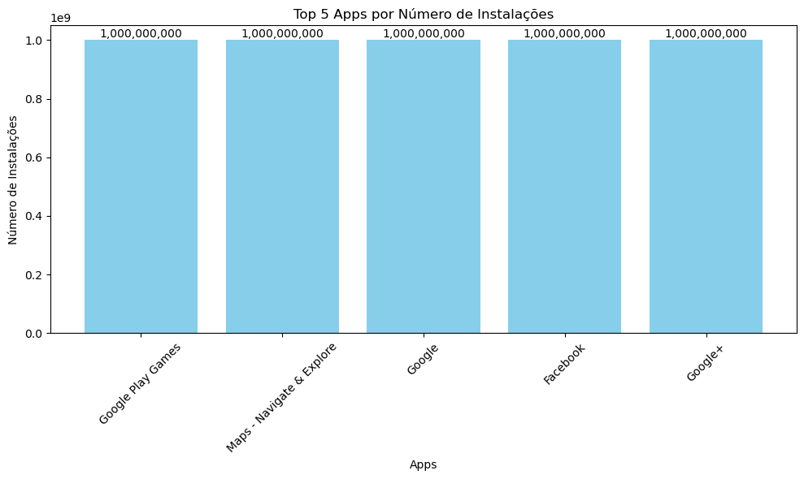

# 🎯 Objetivo

Este README documenta a resuloção do desafio da Sprint 03.  
Trata-se de um `ETL` **(Extração, tratamento e carregamento)**, ou seja: acesso de leitura via Python, extração de dados de um CSV (dataset), tratamentos de duplicidades e tipos de dados, e disponibilização para análise.  
Na etapa de `análise dos dados`, através de bibliotecas típicas de análise de dados, chegamos em listas, valores, gráficos, para responder 7 questões (etapa 2 a 8 do desafio). 

<br/>

# 🎲📝📚 ETL

### Veriricação e tratamento de inconsistências

Foi necessário percorrer o *dataset* verificando se para todas as colunas existiam dados, e verificar, assim, a consistência do conjunto de dados. Neste tópico, três linhas foram capturadas pelo teste, onde através de análise visual da tabela, constatei que apenas uma delas necessitava de tratamento, a linha 10472.

Esse tratamento foi através da função `shift` (que alinha os dados para a coluna seguinte, à direita) e inserção de um 'NaN' na segunda coluna que não possuia a informação adequada.

```python
# Tratamento da linha 10472 para corrigir a inconsistência
import pandas as pd

# Ler o arquivo CSV
data = pd.read_csv('googleplaystore.csv')

# Função para corrigir a linha 10472
def corrigir_linha_10472(df):
    idx = 10472  # Índice da linha a ser corrigida
    if idx in df.index:
        print(f"Linha antes da correção:\n{df.loc[idx]}\n")
        
        # Manter o conteúdo da primeira coluna e preencher a segunda com 'NaN'
        df.loc[idx, df.columns[1:]] = df.loc[idx, df.columns[:-1]].astype(str).shift(1)
        df.loc[idx, 'Category'] = 'NaN'
        
        print(f"Linha após a correção:\n{df.loc[idx]}\n")
    else:
        print("Linha 10472 não encontrada no DataFrame.")
    
    return df

# Aplicar a correção na linha 10472
data = corrigir_linha_10472(data)

# Bloco de código para testar o DataFrame e confirmar que a linha 10472 foi tratada
def testar_dataframe_corrigido(df):
    # Verifica se a linha 10472 tem 13 elementos, incluindo NaNs, e imprime um resumo
    linha_10472 = df.loc[10472]
    num_elementos = len(linha_10472)  # Conta todos os elementos, incluindo NaNs
    print(f"Contagem de elementos na linha 10472 após correção: {num_elementos}")
    if num_elementos == df.shape[1]:
        print("Linha 10472 foi tratada corretamente e não é mais inconsistente.")
    else:
        print("Linha 10472 ainda apresenta inconsistências.")

# Testar o DataFrame
testar_dataframe_corrigido(data)
```
<br/>


### Tratamento de duplicidades e formatos dos dados

Neste bloco de código, buscamos através da função `drop_duplicates`a remoção de linhas idênticas, e na sequência através das funções `astype` e `replace` a conversão dos formatos desejados, separando strings e valores inteiros e float.

``` python
# Bloco de código para tratamentos adicionais no DataFrame

# Remover duplicidades
data = data.drop_duplicates()

# Tratar a coluna 'Price': converter para string, remover o símbolo '$' e converter para float
data['Price'] = data['Price'].astype(str).str.replace('$', '', regex=False).astype(float)

# Converter a coluna 'Reviews' para float e depois para int, tratando erros
data['Reviews'] = pd.to_numeric(data['Reviews'], errors='coerce').fillna(0).astype(int)

# Exibir mensagem de sucesso
def verificar_tratamentos(df):
    print("Tratamentos realizados com sucesso:")
    print(f"Total de linhas após remoção de duplicidades: {df.shape[0]}")
    print(f"Tipo de dados da coluna 'Price': {df['Price'].dtype}")
    print(f"Tipo de dados da coluna 'Reviews': {df['Reviews'].dtype}")

# Verificar o DataFrame após os tratamentos
verificar_tratamentos(data)
```
<br/>
<br/>


# 🔎📊 Análise dos Dados (item 2 ao 8)

Nesta etapa, itens 2 ao 8, resolvemos 'exercícios' onde o objetivo era a obtençao de respostas através das análises dos dados, gerando listas de nomes/ valores, e gráficos.

### Aqui um exemplo, como o item 2 desta etapa do desafio:
Com o *dataframe* pré-tratado e pronto para as análises, geramos um gráfico para obtenção da resposta desejada.

```python
import matplotlib.pyplot as plt

# Converter a coluna 'Installs' para string e remover caracteres indesejados apenas se necessário
data['Installs'] = data['Installs'].astype(str).str.replace(',', '').str.replace('+', '').astype(int)

# Selecionar os top 5 apps por número de instalações
top_5_apps = data.sort_values(by='Installs', ascending=False).head(5)

# Criar o gráfico de barras
plt.figure(figsize=(10, 6))
bars = plt.bar(top_5_apps['App'], top_5_apps['Installs'], color='skyblue')
plt.title('Top 5 Apps por Número de Instalações')
plt.xlabel('Apps')
plt.ylabel('Número de Instalações')
plt.xticks(rotation=45)

# Adicionar os números de instalações em cada barra
for bar in bars:
    yval = bar.get_height()
    plt.text(bar.get_x() + bar.get_width()/2, yval, f'{yval:,}', va='bottom', ha='center')

plt.tight_layout()
plt.show()
```
Gráfico em resposta do exercício:



<br/>

## 🪐 Jupyter notebook - arquivo do desafio na íntegra

⚠️ **[Neste link conseguiremos acessar](../Desafio/desafio.ipynb) o arquivo notebook na íntegra com todos os códigos e respectivas respostas.**
<br/>

    Como é esperado desse tipo de documento (*.ipynb), há blocos de código, as respectivas respostas de cada bloco e separações entre esses blocos através de markdowns 📝  

    Achei interessante esse recurso do Notebook, que permite uma organização e modularização do código. Compreendi que essa funcionalidade é comumente utilizada para a organização de materiais de estudos, apostilagens, tutoriais, etc. 💡 Isso fez muito sentido para mim! 

<br/>

# 📌 Considerações finais sobre a sprint 03

Essa sprint, para mim, foi até aqui a mais desafiadora. 💪
Senti-me parcialmente pronto para as lógicas a serem aplicadas, seja no tema de ETL, seja nos aspectos mais analíticos dos dados. No entanto, ao lidar com a linguagem de programação e a possibilidade de orientação a objetos, percebi que meu poder de abstração precisa ser ainda mais desenvolvido. E achei ótima essa oportunidade! 🌱

A sprint foi cansativa, mas extremamente recompensadora, especialmente no que diz respeito ao desenvolvimento do mindset do cientista de dados. 🧠✨

Compreendi também a importância do ETL, um trabalho que, aparentemente, é mais designado aos Engenheiros de Dados. Com tratamentos bem realizados, a chance de realizar análises de dados com mais qualidade e assertividade é proporcionalmente maior! 📊

Por fim, senti uma inclinação maior pela análise de dados do que pela parte de engenharia. É algo que vou manter em mente e observar mais de perto conforme avanço na bolsa de estudos e nas próximas sprints. 🔍

---