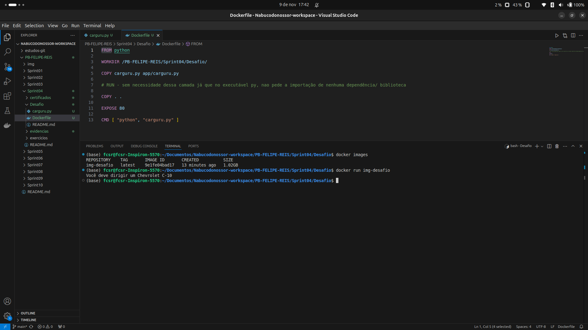
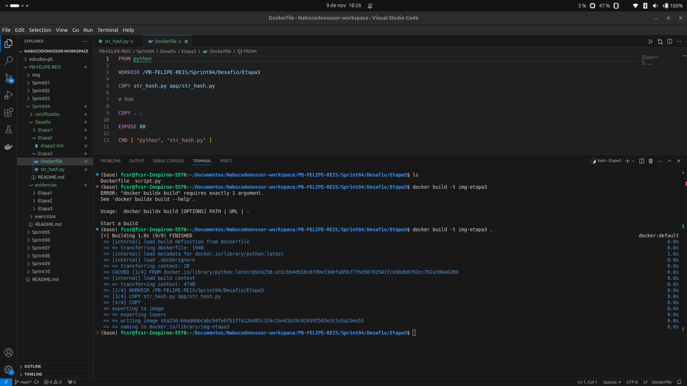
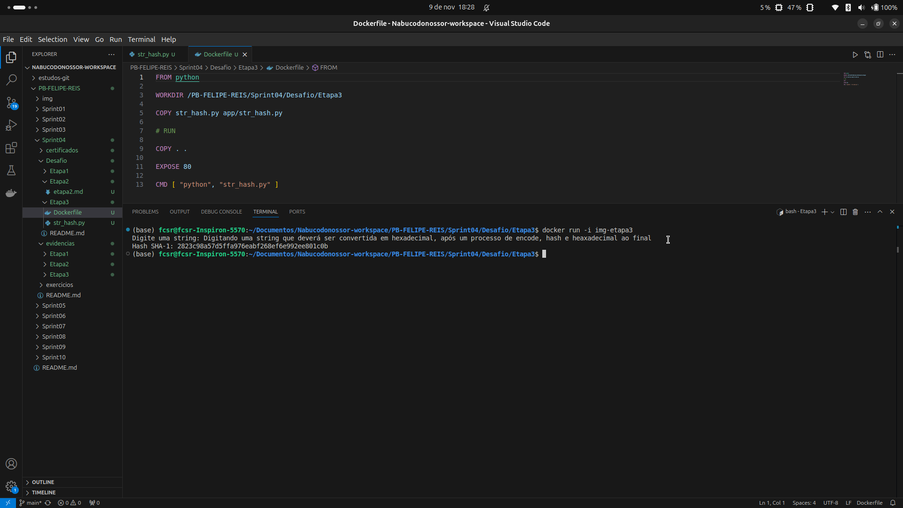

# 🎯 Objetivo

Este README documenta a resolução do desafio da Sprint 04.  
Trata-se da execução de scripts em linguagem Python, através de Containers criados pela ferramenta Docker 🐋. 

O Desafio está dividido em 3 etapas:

<br/>

# Etapa 1 

## Averiguação e entendimento do script "carguru.py" 🔎

``` python
import random

carros = ['Chevrolet Agile','Chevrolet C-10','Chevrolet Camaro','Chevrolet Caravan','Chevrolet Celta','Chevrolet Chevette','Chevrolet Corsa','Chevrolet Covalt','Chevrolet D-20','Chevrolet Monza','Chevrolet Onix','Chevrolet Opala','Chevrolet Veraneio','Citroën C3','Fiat 147','Fiat Argo','Fiat Cronos','Fiat Mobi','Fiat Panorama','Ford Corcel','Ford Escort','Ford F-1000','Ford Ka','Ford Maverick','Honda City','Honda Fit','Hyundai Azera','Hyundai HB20','Hyundai IX-35','Hyundai Veloster','Peugeot 2008','Peugeot 206','Peugeot 208','Peugeot 3008','Peugeot 306','Peugeot 308','Renault Kwid','Renault Logan','Renault Sandero','Renault Twingo','Renault Zoe','Toyota Etios','Toyota Yaris ','Volkswagen Apolo','Volkswagen Bora','Volkswagen Brasilia   ','Volkswagen Fusca','Volkswagen Gol','Volkswagen Kombi','Volkswagen Parati','Volkswagen Passat','Volkswagen Polo','Volkswagen SP2','Volkswagen Santana','Volkswagen Voyage','Volkswagen up!']

random_carros = random.choice(carros)

print('Você deve dirigir um '+ random_carros)
```
O script acima foi fornecido já pronto para ser executado, no desafio.
Seu funcionamento é simples: através da`função `random`, o script imprime uma frase que ao final seleciona um item da lista "carros" para completar a sentença, de forma aleatória.

<br/>

## Criação de Dockerfile 💾🐋

```dockerfile
FROM python

WORKDIR /PB-FELIPE-REIS/Sprint04/Desafio/Etapa1

COPY carguru.py app/carguru.py

# RUN - sem necessidade dessa camada já que no executável py, nao pede a importação de nenhuma dependência/ biblioteca

COPY . .

EXPOSE 80

CMD [ "python", "carguru.py" ]
```
O arquivo Dockerfile se organiza por camadas, que ficam armazenadas em *cache* após a primeira execução. Vamos comentar cada uma das camadas, função e entendimento:  


>**FROM**: é a camada que pede a informação da `imagem base` que pode ser observada no hub de imagens oficial da plataforma Docker. É importante sempre que seja utilizada uma imagem oficial, com bons números de avaliação e utilização pela comunidade.
>
>**WORKDIR**: é a camada que criará diretórios dentro do container, conforme especificado na sintaxe.
>
>**COPY**: essa é a camada que copia arquivos do seu ambiente local para dentro do container, conforme a estrutura de diretório da camada acima, e ainda com a possibilidade de apontamento de subpastas.
>
>**RUN**: é a camada onde podemos solicitar a instalação/ importação de depedências para além da imagem base, como no caso do Python, novas bibliotecas que não sejam as nativas - através, por exemplo, de comando `pip`.
>
>**EXPOSE**: camada que trata de escolha da porta que o container deixará exposta para comunicação com o "mundo exterior", já que o container é fechado para segurança. Essa camada, apenas escolhe a porta que ficará exposta, sendo que a porta do ambiente local que fará a comunicação com o container é escolhida com sintaxe digitada no momento de criação do container.
>
>**CMD**: nessa última camada, com todas escolhas de parâmetros acima, chega o momento da linha de comando que o terminal - dentro do container recém criado/ executado - realizará a execução; tal qual a minha própria digitação no terminal local.

<br/>

## Criação de Imagem 💿
Na etapa de criação de imagem, utilizei o seguinte comando no terminal:
```shell
docker build -it [nome_da_imagem] .
```
Este comando precisa ser executado na mesma pasta onde se encontra o Dockerfile.
Essa execução procura o arquivo e cria a imagem com base nos parâmetros explicados no Dockerfile, sendo o nosso caso a busca da imagem base de Python (na sua última versão oficial no repositório de imagens oficiais Docker).


<br/>

## Criação de Container 🚢
Na etapa de criação de container, utilizei o seguinte comando no terminal:
```shell
docker run --name [nome_do_container] [nome_da_imagem]
```
Este comando precisa ser executado na mesma pasta onde se encontra o Dockerfile.
Essa execução procura a imagem criada acima, cria o container e realiza a execução do comando descrito na Dockerfile, conforme os parâmetros descritos.
Além da criação do container, neste caso do comando com a função `run`, o comando já executando iniciando o container.



<br/>

# Etapa 2
## Avaliação se um container já utilizado, pode ser reutilizado 🔃
Essa etapa faz um questionamento: se após "utilizado" um container pode ser, então, reutilizado. E a resposta é: sim, um container pode ser utilizado N vezes, seja desejado e executado.

Temos duas possibilidades de uso: com o comando `restart` ou `start`, sendo o primeiro para casos onde tenha que se interromper o serviço do container que está ativo/ em execução, e o outro para situações onde o container se encontra já interrompido - por ter sido manualmente interrimpido com `stop` com pois não foi realizado com modo iterativo no terminal/ ou pelo próprio programa que pode rodar em loop infinito.

Neste caso a sintaxe foi:
```shell
docker start -it [nome_do_container]
```
Sendo o `-i` e `-t`, flags para interação e acesso ao terminal, no caso do nosso desafio.


<br/>

# Etapa 3

<br/>

## Criação de script Python - Conversão de string em hexadecimal 🔡🆕🔢
Nesta etapa do desafio foi solicitada a criação de um script, ao invés de um fornecido pronto para a execução.
Trata-se de um script que recebe input de uma string a ser digitada no terminal, e retornar uma hash em hexadecimais.

```python
import hashlib

# Recebe a string via input
input_string = input("Digite uma string: ")

# Gera o hash SHA-1 da string
sha1_hash = hashlib.sha1(input_string.encode()).hexdigest()

# Imprime o hash gerado
print(f"Hash SHA-1: {sha1_hash}")
```

<br/>

## Criação de Dockerfile 💾🐋

```dockerfile
FROM python

WORKDIR /PB-FELIPE-REIS/Sprint04/Desafio/Etapa3

COPY str_hash.py app/str_hash.py

# RUN

COPY . .

EXPOSE 80

CMD [ "python", "str_hash.py" ]
```

<br/>

## Criação de Imagem 💿
Na etapa de criação de imagem, utilizei o seguinte comando no terminal:
```shell
docker build -it [nome_da_imagem] .
```
Este comando precisa ser executado na mesma pasta onde se encontra o Dockerfile.
Essa execução procura o arquivo e cria a imagem com base nos parâmetros explicados no Dockerfile, sendo o nosso caso a busca da imagem base de Python (na sua última versão oficial no repositório de imagens oficiais Docker).



<br/>

## Criação de container 🚢 - com flags -i e -t

Na etapa de criação de container, utilizei o seguinte comando no terminal:
```shell
docker run -it --name [nome_do_container] [nome_da_imagem]
```
Este comando precisa ser executado na mesma pasta onde se encontra o Dockerfile.
Essa execução procura a imagem criada acima, cria o container e realiza a execução do comando descrito na Dockerfile, conforme os parâmetros descritos.
Além da criação do container, neste caso do comando com a função `run -it`, o comando já executando iniciando o container, e em especial mantendo a possibilidade de interação com o script, no terminal que foi mantido aberto para este fim. Ao final da execução, digitação da string, foi retornada a hash esperada.



<br/>

# 📌 Considerações finais sobre a sprint 04

Essa sprint foi, foi um pouco menos desafiadora que a sprint 03, mas ainda assim, por envolver Python houve um bom nível de desafio. Está bem nítido pra mim que preciso praticar mais python e suas sintaxes para ter mais fluidez 💪  

Mergulhei de cabeça nas diferenças entre a programação funcional e a orientada a objetos em Python. À medida que fui dominando as nuances de cada abordagem, percebi que o Poder da POO, com seus objetos e classes, tem um potencial enorme para melhorar a estruturação do código e facilitar a manutenção a longo prazo. Mas ainda há muito a aprender, especialmente para lidar com projetos mais complexos. 🌱

O Docker, por outro lado, tem sido uma verdadeira revelação, sinceramente! 🚀 Comparando com as máquinas virtuais, a leveza e a eficiência dos containers ficaram ainda mais evidentes, e eu consegui entender, de maneira prática, como essas ferramentas podem transformar o desenvolvimento e a implantação de aplicações. O processo de orquestrar containers e manter imagens enxutas com boas práticas me deu uma nova perspectiva sobre como trabalhar com ambientes isolados de forma eficiente. 🧠✨

Ao final dessa sprint, fico mais inclinado a continuar aprofundando o aprendizado em Python e Docker, sempre buscando maneiras de integrar esses conhecimentos no meu desenvolvimento contínuo. Pensativo aqui nos meus próximos desafios no programa de bolsas, e já compreendendo aspectos práticos desse ferramental - utilizado em empresas de tecnologia que eu atuei anteriormente mas em outra área interna. 🔍

---