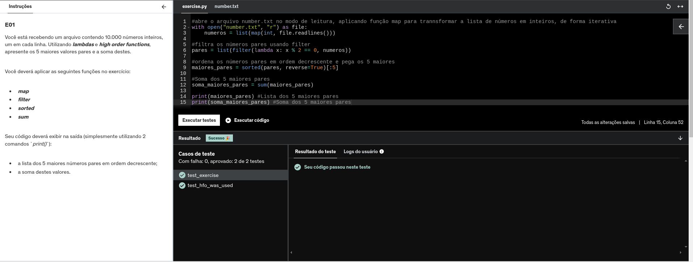
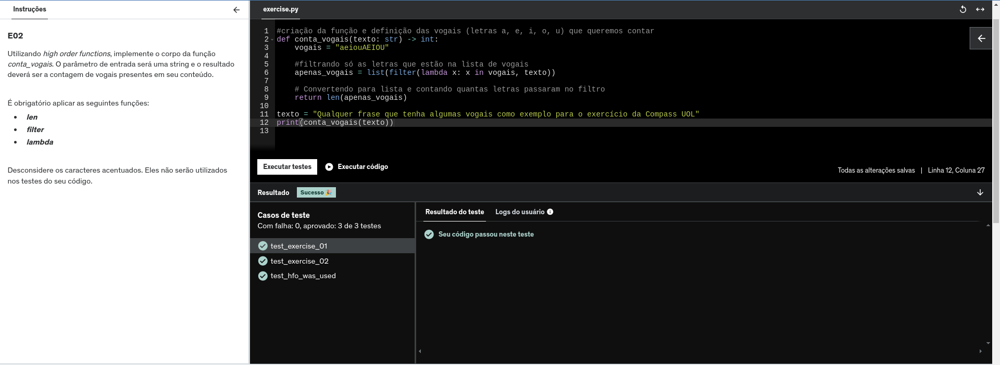
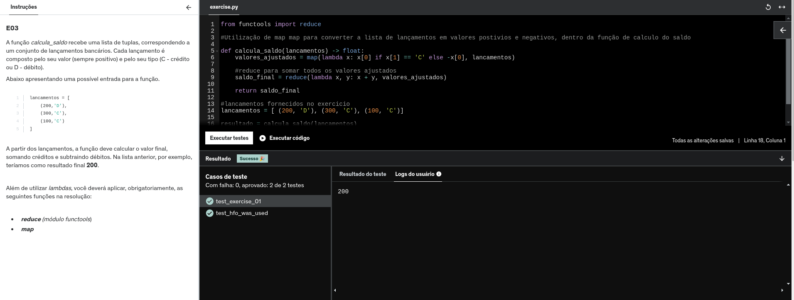
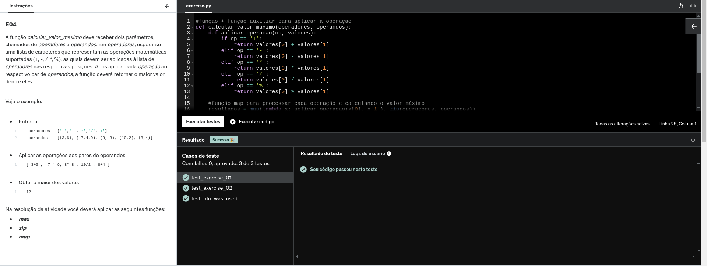
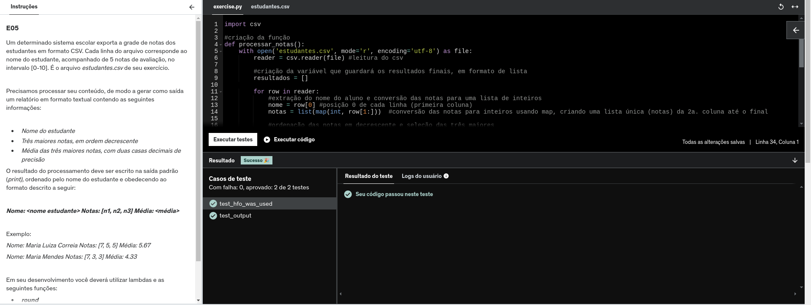
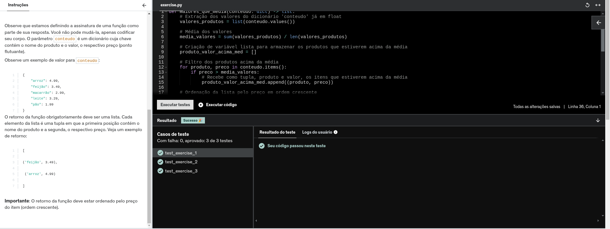
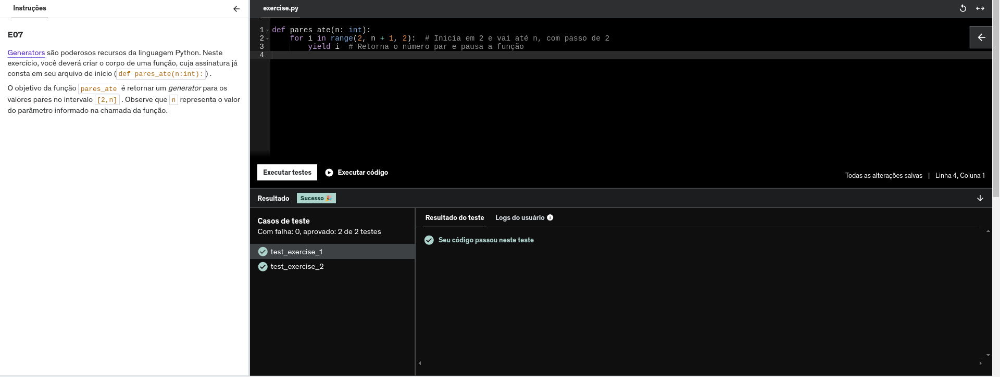
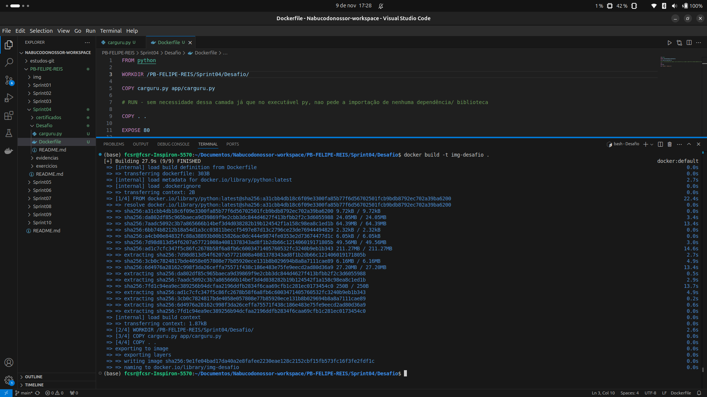
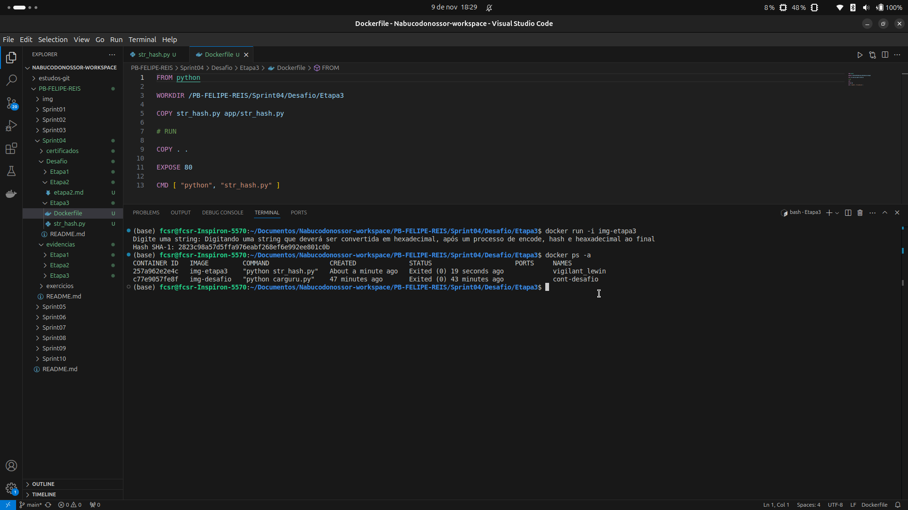
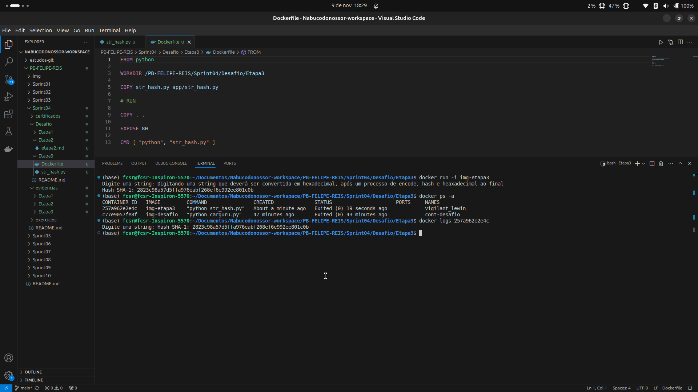

# 💻 Exercícios

Nesta Sprint 04, tratamos de Python - acerca da programação funcional -, e iniciamos aprendizados sobre Docker!  
Para a parte de Python, realizamos alguns exercícios, abaixo.

## Bloco de exercícios Python 🐍

Os resultados esperados estão nos códigos Python, que seguem abaixo e suas respectivas evidências de execução com sucesso:

1.  [Código Python do exercício 1](exercicios/ex01/ex01-codigo.py)

 

2.  [Código Python do exercício 2](exercicios/ex02/ex02-codigo.py) 

 

3.  [Código Python do exercício 3](exercicios/ex03/ex03-codigo.py)

 

4.  [Código Python do exercício 4](exercicios/ex04/ex04-codigo.py) 

 

5.  [Código Python do exercício 5](exercicios/ex05/ex05-codigo.py) 

 

6.  [Código Python do exercício 6](exercicios/ex06/ex06-codigo.py) 

 

7.  [Código Python do exercício 7](exercicios/ex07/ex07-codigo.py)

 

## Sobre Docker 🐋

Para os aprendizados básicos sobre Docker, imagens, containers, sintaxes, temos as evidências abaixo.

1. Criação de Dockerfiles  

 

2. Criação de Imagens

 

3. Criação de Containers

 

4. Logs de execução de Containers

 

# 📜 Certificados

- [Python 3 - Curso Completo do Básico ao Avançado](certificados/Python.png)
- [Docker para Desenvolvedores (com Docker Swarm e Kubernetes)](certificados/docker.png)
- [AWS Partner: Accreditation (technical)](certificados/AWS.png)

   
  
# 🧠 Desafio
**Python (Funcional x Orientação à objetos) e Docker**  
Nos meus estudos de `Python`, tive a oportunidade de explorar tanto a programação funcional quanto a orientada a objetos, duas abordagens que oferecem formas distintas de trabalhar com o código. Na `programação funcional`, o foco está na utilização de funções puras, ou seja, funções que não alteram o estado e sempre retornam o mesmo valor para as mesmas entradas. Além disso, ela favorece a composição de funções e o uso de conceitos como imutabilidade, o que pode tornar o código mais previsível e fácil de testar. Já na `programação orientada a objetos (POO)`, a ideia é organizar o código em torno de objetos que encapsulam dados e comportamentos. A POO ajuda a modelar o mundo real de uma forma mais intuitiva, permitindo que se aproveite o conceito de herança e polimorfismo para promover reusabilidade e flexibilidade. Ambas as abordagens têm suas vantagens, e saber como aplicá-las dependendo do contexto é algo que estou cada vez mais aprendendo.

Quanto ao `Docker`, essa ferramenta tem sido essencial para o meu aprendizado sobre containers e como eles se comparam às tradicionais máquinas virtuais (VMs). Enquanto as VMs virtualizam todo o sistema operacional, consumindo mais recursos e exigindo mais manutenção, os containers permitem uma virtualização mais leve, isolando apenas as aplicações e suas dependências, sem a necessidade de replicar o sistema inteiro. Isso torna o processo de desenvolvimento e implantação mais ágil e eficiente. Em termos de melhores práticas no uso de Docker, é fundamental manter as imagens pequenas, usar *multistage builds* para otimizar a criação de containers e garantir que os containers sejam imutáveis, facilitando a escalabilidade e manutenção. Além disso, a integração com ferramentas como `Docker Compose` parece ser o caminho para gerenciar ambientes mais complexos, especialmente quando há a necessidade de orquestrar múltiplos containers.

[Confira o 'readme' do desafio aqui!](Desafio/README.md)