# 💻 Exercícios

Nesta Sprint 05, nos aprofundamos ainda mais no universo da AWS. Embora já estivéssemos realizando cursos e trilhas sobre a proposta de valor da `Amazon Web Services` e suas funcionalidades, agora tivemos a oportunidade de praticar diretamente no console da AWS. A plataforma é robusta e oferece soluções para empresas de todos os portes, desde pequenas até gigantes. 🚀

Após completar dois cursos sugeridos — o `AWS Cloud Quest` (um jogo que simula desafios do dia a dia de um servidor de TI, com a utilização de várias soluções da AWS) e o curso preparatório para a certificação `AWS Certified Cloud Practitioner` —, entrei no exercício proposto para esta sprint.

## Exercício com AWS S3 🗃️

O exercício consistia em criar um bucket no serviço `S3` da AWS, com algumas especificações, e realizar o upload de arquivos: um `index.html`, um `nomes.csv`, e um `404.html`. O objetivo era configurar um [site estático, acessível através de um endpoint](http://bucket-exercicio-sprint05.s3-website-us-east-1.amazonaws.com/) . Abaixo estão as etapas e as evidências com comentários explicativos:

### Etapas:

1.  Instalação da biblioteca boto3, um SDK oficial da AWS para Python
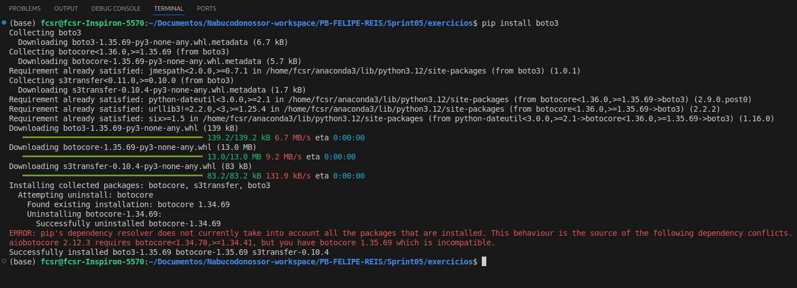

<br/>

2.  Instalação da ferramenta AWS CLI (Command Line Interface), que realiza o login via SSO, para que boto3 possa realizar sua função de integração do local com ambiente AWS
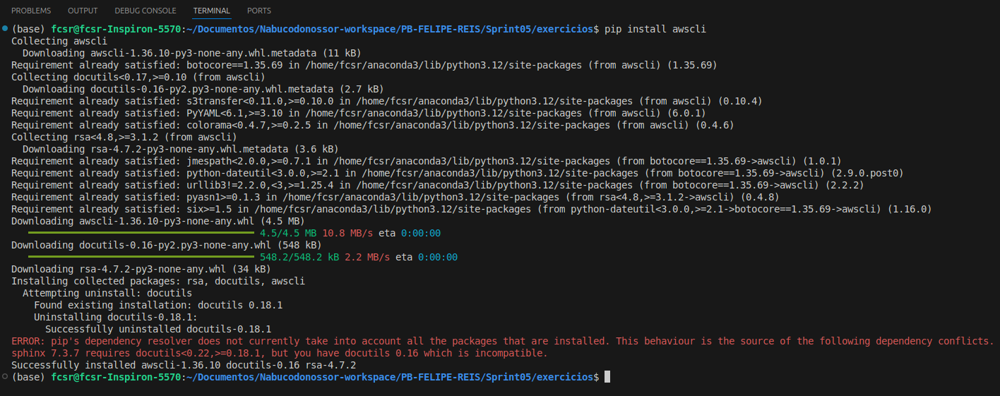

<br/>

3.  Configuração e estabelecimento de login via SSO
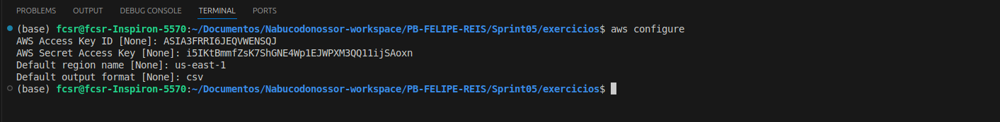
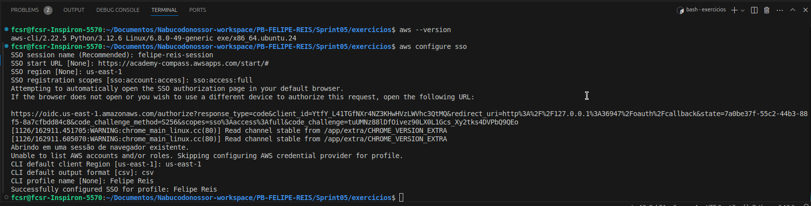

<br/>

4.  Aqui o scrpit que cria o bucket, define site estático, e configura política de publicização do site.
``` python
import boto3
import json
from botocore.exceptions import ClientError

# Criando cliente S3
s3 = boto3.client('s3', region_name='us-east-1')

# Nome do bucket e arquivos a serem carregados
bucket_name = 'bucket-exercicio-sprint05'
index_document = 'index.html'
error_document = '404.html'
index_file_path = 'index.html'
csv_file_path = 'nomes.csv'
error_file_path = '404.html'

# Função para criar o bucket
def create_bucket(bucket_name):
    try:
        s3.create_bucket(Bucket=bucket_name)
        print(f"Bucket '{bucket_name}' criado com sucesso!")
    except ClientError as e:
        print(f"Erro ao criar o bucket: {e}")

# Função para habilitar hospedagem de site estático
def enable_static_website(bucket_name, index_document, error_document):
    try:
        s3.put_bucket_website(
            Bucket=bucket_name,
            WebsiteConfiguration={
                'IndexDocument': {'Suffix': index_document},
                'ErrorDocument': {'Key': error_document}
            }
        )
        print(f"Hospedagem de site estático habilitada para o bucket '{bucket_name}'!")
    except ClientError as e:
        print(f"Erro ao configurar a hospedagem de site estático: {e}")

# Função para desabilitar o bloqueio de acesso público
def disable_public_access_block(bucket_name):
    try:
        s3.put_public_access_block(
            Bucket=bucket_name,
            PublicAccessBlockConfiguration={
                'BlockPublicAcls': False,
                'IgnorePublicAcls': False,
                'BlockPublicPolicy': False,
                'RestrictPublicBuckets': False
            }
        )
        print(f"Bloqueio de acesso público desabilitado para o bucket '{bucket_name}'!")
    except ClientError as e:
        print(f"Erro ao desabilitar o bloqueio de acesso público: {e}")

# Função para configurar a política de acesso público
def set_bucket_policy(bucket_name):
    policy = {
        "Version": "2012-10-17",
        "Statement": [
            {
                "Sid": "PublicReadGetObject",
                "Effect": "Allow",
                "Principal": "*",
                "Action": ["s3:GetObject"],
                "Resource": [f"arn:aws:s3:::{bucket_name}/*"]
            }
        ]
    }
    try:
        policy_json = json.dumps(policy)
        s3.put_bucket_policy(Bucket=bucket_name, Policy=policy_json)
        print(f"Política de acesso público configurada para o bucket '{bucket_name}'!")
    except ClientError as e:
        print(f"Erro ao configurar a política de bucket: {e}")

# Função para fazer o upload de um arquivo para o bucket
def upload_file_to_s3(local_file_path, bucket_name, s3_key, content_type=None):
    try:
        extra_args = {}
        if content_type:
            extra_args['ContentType'] = content_type
        s3.upload_file(local_file_path, bucket_name, s3_key, ExtraArgs=extra_args)
        print(f"Arquivo '{local_file_path}' enviado com sucesso para '{bucket_name}/{s3_key}'!")
    except ClientError as e:
        print(f"Erro ao enviar o arquivo {local_file_path} para o S3: {e}")

# Função para realizar o upload de arquivos
def upload_files():
    upload_file_to_s3(index_file_path, bucket_name, 'index.html', content_type='text/html')
    upload_file_to_s3(csv_file_path, bucket_name, 'dados/nomes.csv', content_type='text/csv')
    upload_file_to_s3(error_file_path, bucket_name, '404.html', content_type='text/html')

# Função principal
def main():
    create_bucket(bucket_name)
    enable_static_website(bucket_name, index_document, error_document)
    disable_public_access_block(bucket_name)
    set_bucket_policy(bucket_name)
    upload_files()

if __name__ == '__main__':
    main()

```

5.  E por fim, as evidências do bucket (via console) vazio, depois com o bucket criado, os arquivos que subiram, e as comprovações de que o código foi bem sucessido nas parametrizações todas solicitadas.  

<br/>

Bucket vazio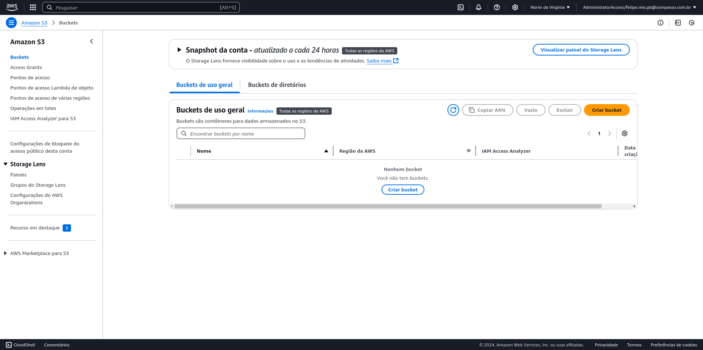
Bucket criado com sucesso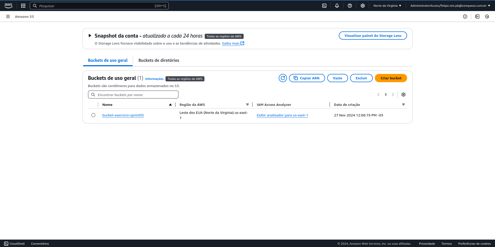
Bucket com objetos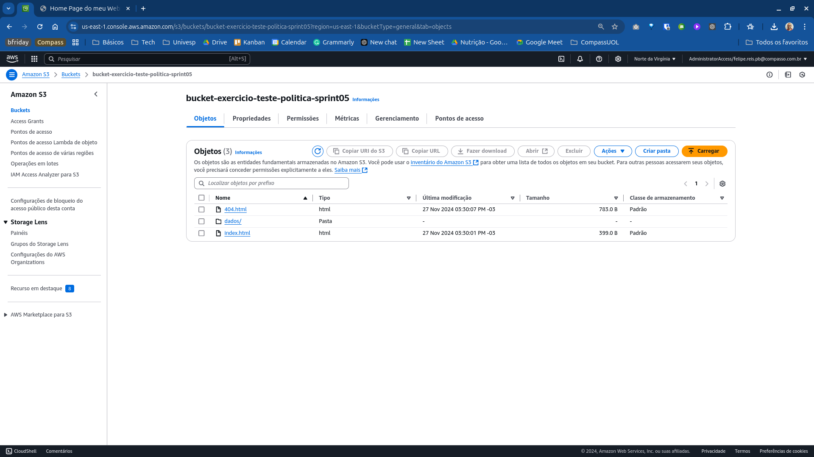
Bucket com sua política criada com sucesso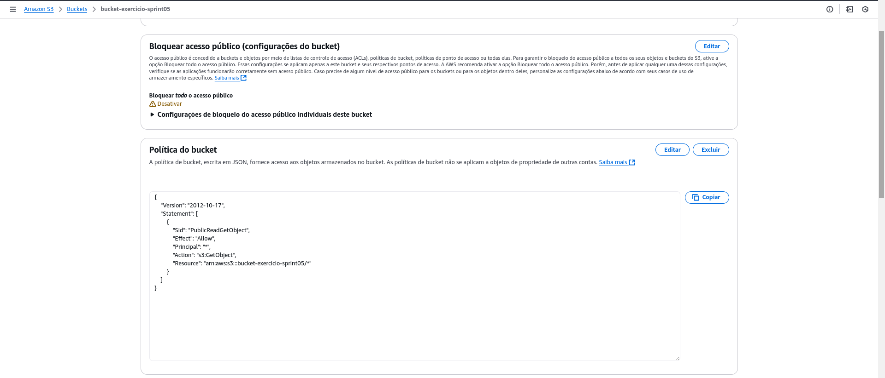
Bucket com site estático configurado com sucesso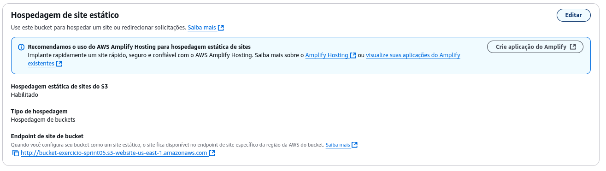
Site funcionando através do endpoint e download do arquivo ocorrendo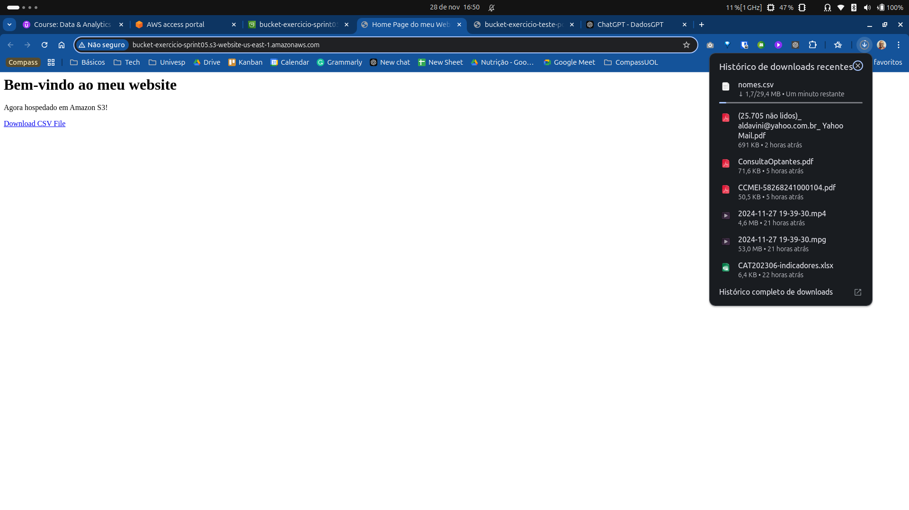

<br/>

# 📜 Certificados

- AWS Cloud Quest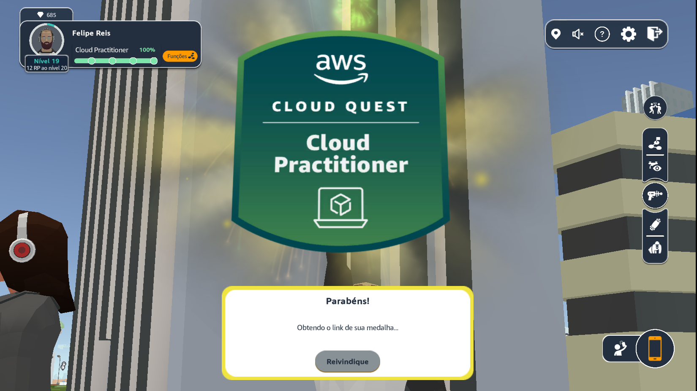
- [Preparatório para AWS Certified Cloud Practitioner](certificados/docker.png)

<br/>  
  
# 🧠 Desafio
**Amazon Web Services e S3**  
Descobrir o AWS S3 foi como abrir uma porta para um universo de possibilidades que eu nem sabia que estavam ao meu alcance. Imagine ter um espaço na nuvem que não só guarda seus arquivos, mas também os organiza, protege e disponibiliza de formas que facilitam muito o trabalho, seja para algo simples como armazenar backups ou para projetos mais robustos como sites e análises de dados. É como se tudo que você precisa para lidar com armazenamento estivesse ali, pronto para ser usado com um clique ou algumas linhas de código.

O que mais me encantou foi a simplicidade combinada com a sofisticação. Criar um bucket e configurar as permissões é algo super direto, mas, ao mesmo tempo, dá para fazer coisas incríveis, como hospedar um site estático ou definir políticas de acesso detalhadas. Sem falar nas classes de armazenamento, que ajustam os custos e a performance conforme a necessidade. Para alguém que está começando a explorar a AWS, é fácil se apaixonar pela ideia de ter uma ferramenta tão poderosa e acessível como o S3 ao alcance das mãos.

[Confira o 'readme' do desafio aqui!](Desafio/README.md)