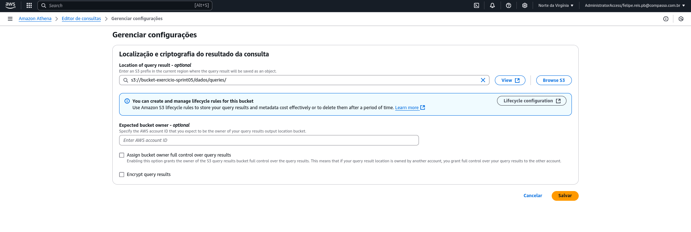
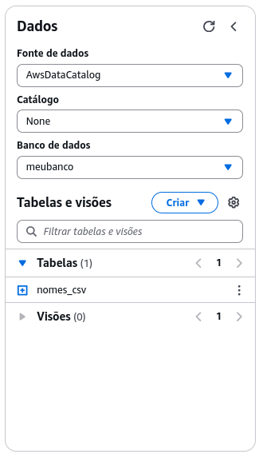
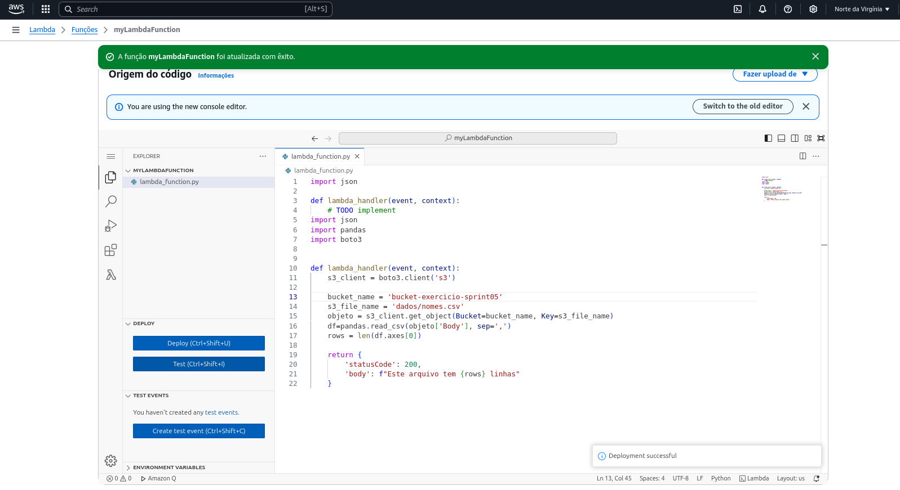
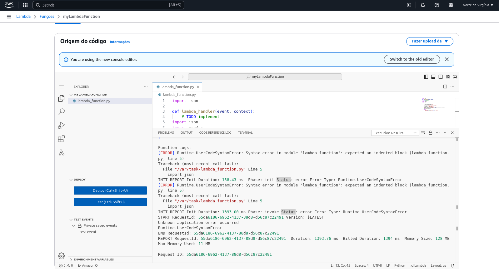
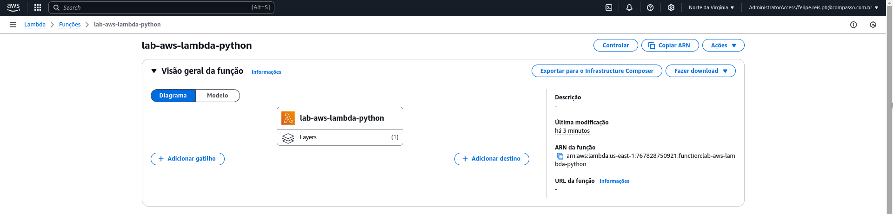
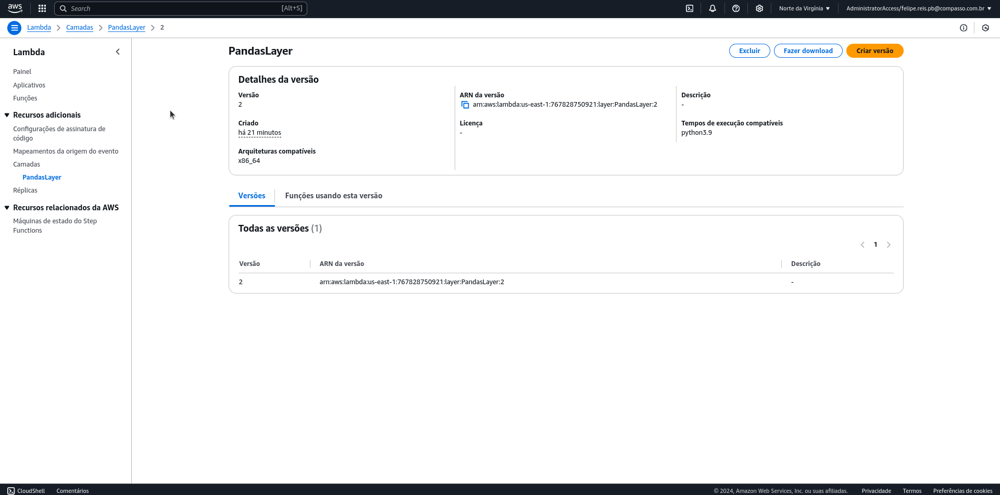
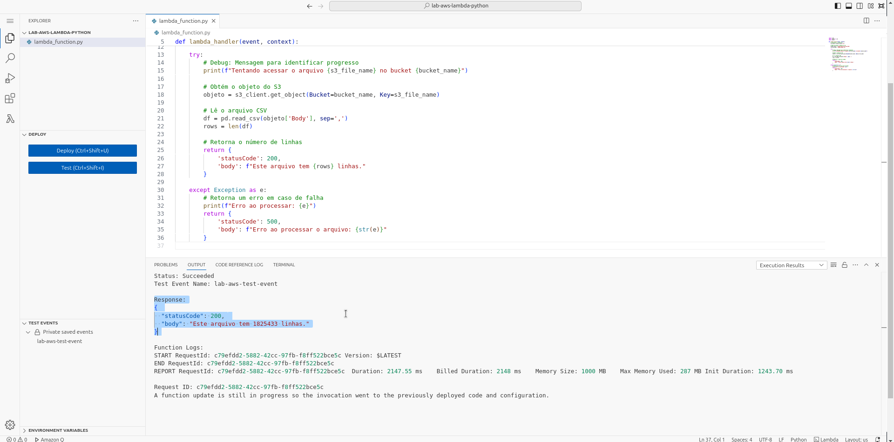
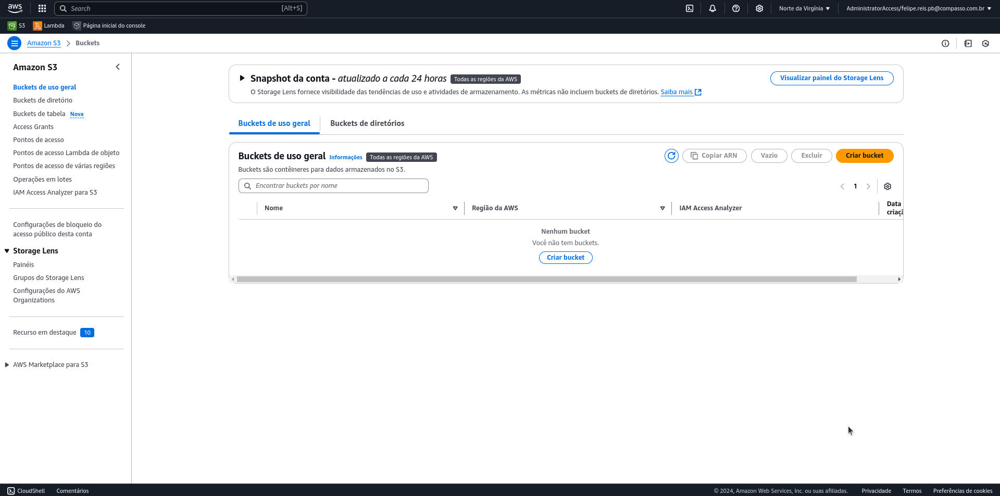

# 💻 Exercícios

Nesta sprint 06, iniciamos a primeira etapa de construção do **Desafio Final** do Programa de Bolsas da Compass UOL - a primeira de 5 etapas.
Ademais, seguimos com, até agora, o maior aprofundamento no **Console AWS** e seus diversos serviços para computação em nuvem. 

Agora foi o momento de exercitarmos mais um pouco no `AWS S3` e seus buckets, `AWS Athena` com consultas em SQL, e por fim `AWS Lambda` com execução de scripts em python sem a necessidade de um servidor, o chamado serviço *serverless*.

## Exercício com AWS Athena 🦉

O exercício consistiu acessar o arquivo `nomes.csv` que estava alocado no *bucket* do `AWS S3` (da sprint 05), e realizar consultas em SQL. Para isso criamos um banco de dados, e importamos o `csv` como tabela diretamente do `AWS S3` para `AWS Athena`.

Parametrização para salvar queries na pasta indicada, dentro do armazenamento do `AWS S3`:


<br/>

Evidência do banco de dado e tabela criadas no `AWS Athena`, com origem no armazenamento de `AWS S3`:


<br/>
Após esta configuração inicial do serviço, realizei duas consultas com os seguintes parâmetros e retorno.

**Consulta 1**: 
``` sql
select nome 
from meubanco.nomes_csv 
where ano = 1999 
order by total limit 15;
```
Com o seguinte resultado, no [link que leva ao `csv`](../Sprint06/exercicios/3-lab_aws_athena/query1_results.csv).

<br/>

**Consulta 2** : 
``` sql
WITH decadas AS (
    SELECT
        nome,
        total,
        ano,
        FLOOR((ano - 1950) / 10) * 10 + 1950 AS decada
    FROM meubanco.nomes_csv
    WHERE ano >= 1950
),
ContagemPorDecada AS (
    SELECT
        decada,
        nome,
        SUM(total) AS total_uso
    FROM Decadas
    GROUP BY decada, nome
),
RankedNomes AS (
    SELECT
        decada,
        nome,
        total_uso,
        RANK() OVER (PARTITION BY decada ORDER BY total_uso DESC) AS rank
    FROM ContagemPorDecada
)
SELECT
    decada,
    nome,
    total_uso
FROM RankedNomes
WHERE rank <= 3
ORDER BY decada, rank;
```
Com o seguinte resultado, no [link que leva ao `csv`](../Sprint06/exercicios/3-lab_aws_athena/query2_results.csv).

<br/>

## Exercício com AWS Lambda ⚡

No exercício com `AWS Lambda`, a idéia foi aproveitar o mesmo `nomes.csv`para ser base de uma função simples em `Python 3.9` que objetiva contar quantas linhas há no arquivo.



Somos conduzidos até um erro proposital, já que não existe a `biblioteca pandas`nativa naquela versão do python. 



E ajustamos isso criando um container que terá essas bibliotecas necessárias. Após isso, compactamos as bibliotecas num `.zip` e subimos ao Lambda, num formato de camada.






Após isso ainda, configuramos essa camada, para que a execução do código consiga extrair o que necessita da camada com a biblioteca, e por fim o código é executado com sucesso.



Aqui é possível verificar o script em python com a necessidade da biblioteca.

```python
import json
import pandas as pd
import boto3

def lambda_handler(event, context):
    # Inicializa o cliente S3
    s3_client = boto3.client('s3')
    
    # Nome do bucket e arquivo no S3
    bucket_name = 'bucket-exercicio-sprint05'
    s3_file_name = 'dados/nomes.csv'
    
    try:
        # Debug: Mensagem para identificar progresso
        print(f"Tentando acessar o arquivo {s3_file_name} no bucket {bucket_name}")
        
        # Obtém o objeto do S3
        objeto = s3_client.get_object(Bucket=bucket_name, Key=s3_file_name)
        
        # Lê o arquivo CSV
        df = pd.read_csv(objeto['Body'], sep=',')
        rows = len(df)
        
        # Retorna o número de linhas
        return {
            'statusCode': 200,
            'body': f"Este arquivo tem {rows} linhas."
        }
    
    except Exception as e:
        # Retorna um erro em caso de falha
        print(f"Erro ao processar: {e}")
        return {
            'statusCode': 500,
            'body': f"Erro ao processar o arquivo: {str(e)}"
        }
```

<br/>

E aqui abaixo o dockerfile que foi direcionado nas instruções do exercício.

```dockerfile
FROM amazonlinux:2023
RUN yum update -y
RUN yum install -y \
python3-pip \
zip
RUN yum -y clean all
```
<br/>

Além de, por fim, [o arquivo .zip, que foi alocado](../Sprint06/exercicios/4-lab_aws_lambda/minha-camada-pandas.zip) como camada no AWS Lambda

<br/>

## Limpeza 🗑️

Ao final é solicitada a limpeza dos buckets criados até então, na intenção de não gerar cobranças desnecessárias no `Console AWS`.



<br/>

# 📜 Certificados

- [Fundamentals of Analytics - Part 1](../Sprint06/certificados/Analyticsp1.png)
- [Fundamentals of Analytics - Part 2](../Sprint06/certificados/Analyticsp2.png)
- [Introduction to Amazon Athena](../Sprint06/certificados/Athena.png)
- [Amazon EMR](../Sprint06/certificados/EMR.png)
- [AWS Glue Getting Started](../Sprint06/certificados/Glue.png)
- [Getting Started with Amazon Redshift](../Sprint06/certificados/Redshift.png)
- [Best Practices for Data Warehousing with Amazon Redshift](../Sprint06/certificados/Redshift-DW.png)
- [Serverless Analytics](../Sprint06/certificados/Analyticsp1.png)
- [Amazon QuickSight - Getting Started](../Sprint06/certificados/QuickSight.png)

<br/>  
  
# 🧠 Desafio
**AWS S3, Containers e Python 3.9: Automatizando o Pipeline de Dados**  
O desafio dessa sprint foi uma experiência interessante e desafiadora no uso de AWS S3 e containers, com um foco em automação e estruturação de dados na nuvem. O objetivo foi organizar e enviar dois arquivos CSV, movies.csv e series.csv, para um bucket no S3, seguindo uma estrutura específica que foi detalhada nos slides do desafio. Esses arquivos foram alocados em uma zona de raw data, criando um ponto inicial para análises futuras.

O que realmente me impressionou nesta sprint foi a orientação para utilizar um container com Python 3.9. Essa abordagem, ao invés de usar o ambiente local, foi uma maneira muito eficiente de garantir que o código tivesse as dependências necessárias e funcionasse de maneira consistente em diferentes ambientes. Além disso, ao utilizar um container, a solução ficou mais "flat", sem depender das configurações específicas da minha máquina, o que facilita a replicação em diferentes contextos, seja para testes ou produção.

Por fim, um script em Python foi criado para automatizar todo o processo: desde a criação do bucket no S3, passando pela estruturação das pastas, até o upload dos arquivos CSV. A simplicidade e a eficiência dessa automação não só simplificaram o processo como também ajudaram a entender melhor como integrar os diferentes componentes da AWS em um fluxo de trabalho coeso e bem estruturado.

Essa sprint, com sua combinação de serviços da AWS e containers, me mostrou como é possível trabalhar de maneira mais ágil e escalável, sem depender de configurações locais, garantindo flexibilidade e controle sobre os dados na nuvem.

[Confira o 'readme' do desafio aqui!](Desafio/README.md)