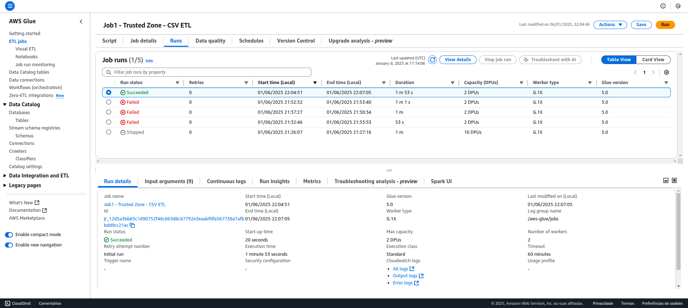
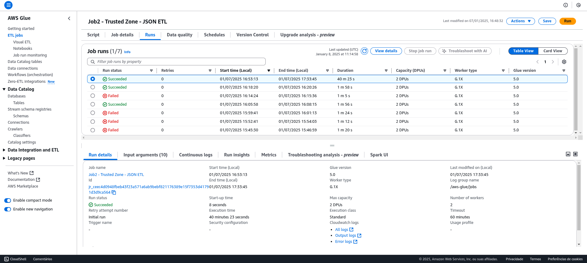
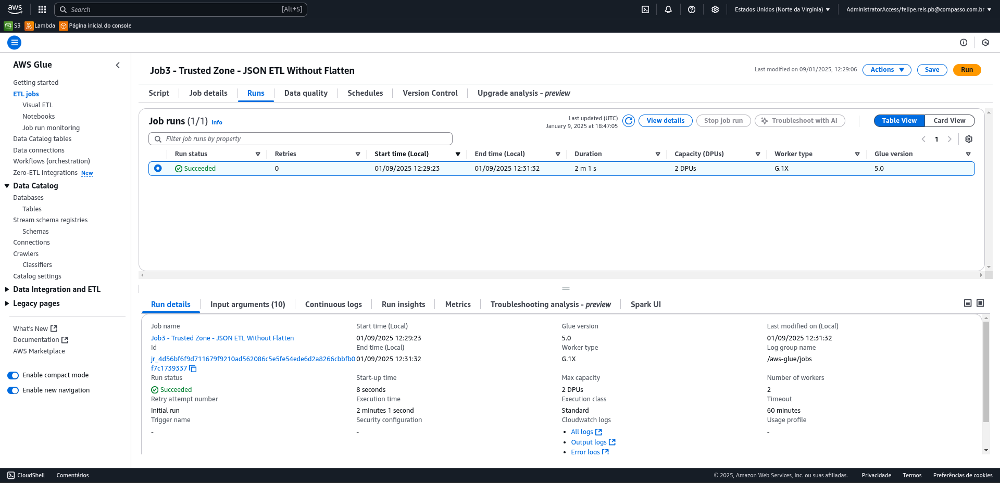
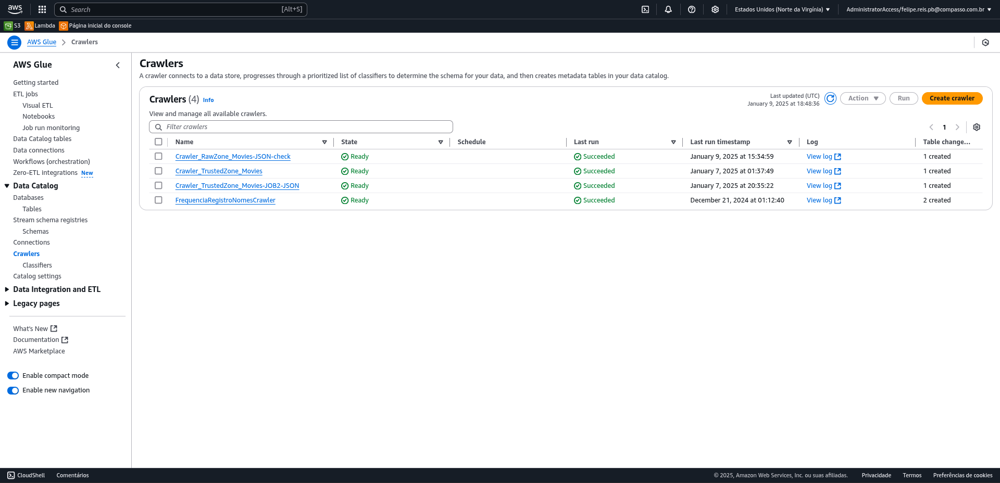
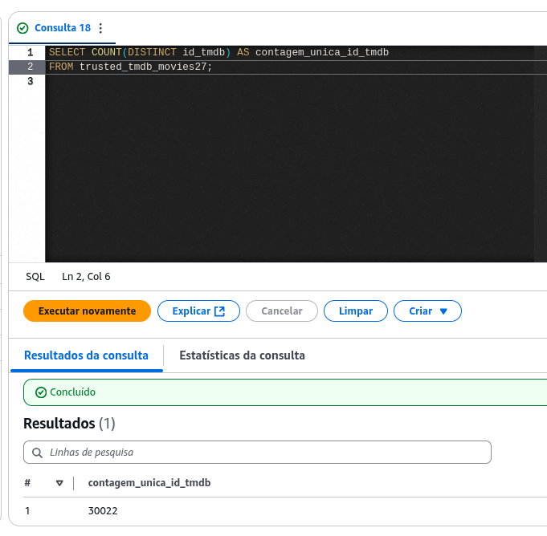
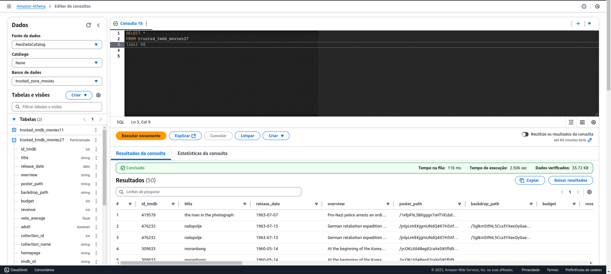
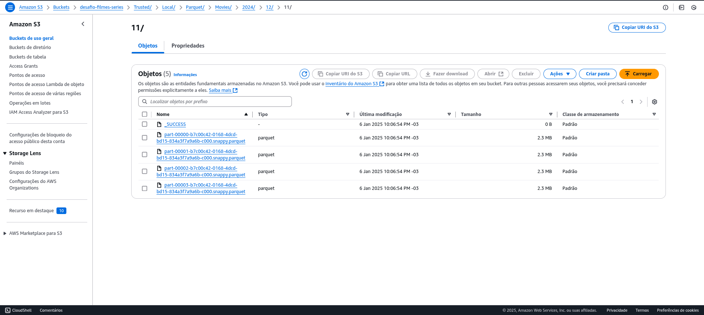
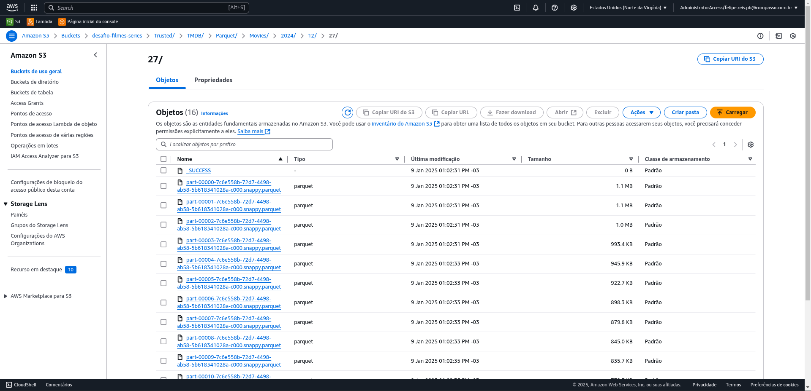

## 🎯 Objetivo 🔴🔴🔴

- Explicitar as questões novamente
- os 2 jobs do glue
- prints e código
- print do config do job mostrando os 60 ou menos, G 1x e woerkrs 2


## 🎯 Objetivo
Este README documenta o progresso e as validações realizadas durante o Desafio Final do Programa de Bolsas da Compass UOL (etapa 3 de 5), com foco na Sprint 08. Nesta etapa, o objetivo principal foi consolidar um pipeline de dados robusto, que abrange desde a coleta e tratamento de dados até a análise e validação, utilizando tecnologias como AWS Glue, Athena, S3 e PySpark. Os dados utilizados foram extraídos da API pública do TMDB,  e também dados entregues pelo PB com origem no IMDB, com foco nos gêneros Crime e Guerra.
<br/>

## ✍ Escopo das atividades
Nesta sprint, as atividades foram organizadas em duas frentes principais:

#### Processamento de dados brutos e geração de arquivos Parquet

- Aplicação de filtros em arquivos CSV para selecionar registros dos gêneros Crime e Guerra.

- Salvamento dos dados filtrados em formato Parquet na camada Trusted, organizada no S3.

- Validação dos dados utilizando AWS Glue, Athena e DBeaver para garantir consistência e integridade.

- Validação do impacto do Flattening
<br/>

#### Identificação e resolução de inconsistências entre as camadas Raw e Trusted.

- Verificação do impacto do processo de flattening nos arrays, com foco na diminuição significativa de registros únicos.

- Criação de um novo pipeline sem aplicar flatten, para preservar a estrutura aninhada dos dados, e por conseguinte prevalecer dados consistentes na camada Trusted.
<br/>

## ▶️ Resolução do desafio!

### Processamento com PySpark e AWS Glue (constituição da Trusted Zone)
#### Job 1 - Processamento do CSV (raw zone)

Um script PySpark foi desenvolvido para:

- Ler arquivos CSV da camada Raw no S3.
- Aplicar filtros para os gêneros Crime e Guerra.
- Realizar tratamentos, como remoção de duplicatas e substituição de valores inválidos por NULL.
- ajuste de metadados/ schema dos dados.
- Salvar os dados tratados em Parquet na camada Trusted no S3.

O script foi executado no AWS Glue, garantindo escalabilidade e eficiência no processamento.

``` python
from pyspark.context import SparkContext
from awsglue.context import GlueContext
from awsglue.job import Job
from pyspark.sql.functions import col, when, trim, lower
from pyspark.sql.types import StructType, StructField, StringType, IntegerType, FloatType

# Inicializando o contexto do Glue e Spark
sc = SparkContext()
glueContext = GlueContext(sc)
spark = glueContext.spark_session
job = Job(glueContext)

# Nome do Job (definido diretamente no código)
job_name = "Job1 - Trusted Zone - CSV ETL"
job.init(job_name, {})

# Caminhos S3
raw_path = "s3://desafio-filmes-series/Raw/Local/CSV/Movies/2024/12/11/movies.csv"
trusted_path = "s3://desafio-filmes-series/Trusted/Local/Parquet/Movies/2024/12/11/"

# Definindo o schema manualmente
schema = StructType([
    StructField("id", StringType(), True),
    StructField("tituloPincipal", StringType(), True),  # Nome corrigido conforme o CSV
    StructField("tituloOriginal", StringType(), True),
    StructField("anoLancamento", IntegerType(), True),
    StructField("tempoMinutos", IntegerType(), True),
    StructField("genero", StringType(), True),
    StructField("notaMedia", FloatType(), True),
    StructField("numeroVotos", IntegerType(), True),
    StructField("generoArtista", StringType(), True),
    StructField("personagem", StringType(), True),
    StructField("nomeArtista", StringType(), True),
    StructField("anoNascimento", IntegerType(), True),
    StructField("anoFalecimento", IntegerType(), True),
    StructField("profissao", StringType(), True),
    StructField("titulosMaisConhecidos", StringType(), True)
])

# Leitura do CSV com o schema definido
df = spark.read.csv(
    raw_path,
    schema=schema,
    sep='|',
    encoding='UTF-8',
    header=True
)

# Substituindo campos vazios ("") por NULL
df = df.replace("", None)

# Substituindo valores "N" por NULL nas colunas especificadas
columns_to_clean = ["tempoMinutos", "genero", "personagem", "anoNascimento", "anoFalecimento", "titulosMaisConhecidos"]
for col_name in columns_to_clean:
    df = df.withColumn(col_name, when(col(col_name) == "N", None).otherwise(col(col_name)))

# Removendo duplicatas
df = df.dropDuplicates()

# Normalizando colunas de texto (corrigindo também o nome errado da coluna)
df = df.withColumn("tituloPincipal", trim(lower(col("tituloPincipal"))))
df = df.withColumn("tituloOriginal", trim(lower(col("tituloOriginal"))))

# Filtrando filmes de Crime ou Guerra
df_filtered = df.filter(
    (col("genero").isNotNull()) & (
        (col("genero").like("%Crime%")) | 
        (col("genero").like("%Guerra%")) | 
        (col("genero").like("%War%"))
    )
)

# Escrevendo os dados na camada Trusted em formato PARQUET
df_filtered.write.mode("overwrite").parquet(trusted_path)

# Finalizando o job
job.commit()
print("Job finalizado com sucesso!")
```




#### Job 2 - Processamento dos JSONs (raw zone)

Outro script PySpark foi desenvolvido para:

- Ler arquivos JSON da camada Raw no S3.
- Realizar tratamentos, como remoção de duplicatas e substituição de valores inválidos por NULL.
- Ajuste de metadados/ schema dos dados.
- Explosão de Arrays em novas linhas (função `flatten`)
- Salvar os dados tratados em Parquet na camada Trusted no S3.

O script foi executado no AWS Glue, garantindo escalabilidade e eficiência no processamento.

```python
from pyspark.context import SparkContext
from awsglue.context import GlueContext
from awsglue.job import Job
from pyspark.sql.functions import col, trim, lower, when, explode, size, input_file_name, regexp_extract
from pyspark.sql.types import StructType, StructField, StringType, IntegerType, FloatType, BooleanType, DateType, ArrayType

# Inicializando o contexto do Glue e Spark
sc = SparkContext()
glueContext = GlueContext(sc)
spark = glueContext.spark_session
job = Job(glueContext)

# Nome do Job (definido diretamente no código)
job_name = "Job2 - Trusted Zone - JSON ETL"
job.init(job_name, {})

# Caminhos S3
raw_path = "s3://desafio-filmes-series/Raw/TMDB/JSON/Movies/2024/12/27/"
trusted_path = "s3://desafio-filmes-series/Trusted/TMDB/Parquet/Movies/2024/12/27/"

# Definição do schema
schema = StructType([
    StructField("id_tmdb", IntegerType(), True),
    StructField("title", StringType(), True),
    StructField("release_date", DateType(), True),
    StructField("overview", StringType(), True),
    StructField("poster_path", StringType(), True),
    StructField("backdrop_path", StringType(), True),
    StructField("production_companies", ArrayType(
        StructType([
            StructField("name", StringType(), True),
            StructField("id", IntegerType(), True)
        ])
    ), True),
    StructField("production_countries", ArrayType(
        StructType([
            StructField("iso_3166_1", StringType(), True),
            StructField("name", StringType(), True)
        ])
    ), True),
    StructField("spoken_languages", ArrayType(
        StructType([
            StructField("iso_639_1", StringType(), True),
            StructField("name", StringType(), True)
        ])
    ), True),
    StructField("budget", IntegerType(), True),
    StructField("revenue", IntegerType(), True),
    StructField("vote_average", FloatType(), True),
    StructField("adult", BooleanType(), True),
    StructField("belongs_to_collection", StructType([
        StructField("id", IntegerType(), True),
        StructField("name", StringType(), True)
    ]), True),
    StructField("homepage", StringType(), True),
    StructField("imdb_id", StringType(), True),
    StructField("original_language", StringType(), True),
    StructField("popularity", FloatType(), True),
    StructField("status", StringType(), True),
    StructField("tagline", StringType(), True),
    StructField("video", BooleanType(), True)
])

# Leitura dos arquivos JSON com o schema definido
df = spark.read.json(
    raw_path,
    schema=schema,
    multiLine=True
)

# Adicionando o nome do arquivo como coluna "source_file"
df = df.withColumn("source_file", input_file_name())

# Extraindo o gênero do nome do arquivo e adicionando como coluna "genre"
df = df.withColumn("genre", regexp_extract(col("source_file"), r"genre-(\d+)-", 1))

# Mapeando códigos de gênero para nomes legíveis
genre_map = {"80": "Crime", "10752": "War"}
genre_keys = list(genre_map.keys())

df = df.withColumn("genre", when(col("genre").isin(genre_keys), col("genre").cast(StringType())).alias("genre_name"))
for code, name in genre_map.items():
    df = df.withColumn("genre", when(col("genre") == code, name).otherwise(col("genre")))

# Substituindo listas vazias ("[]") por NULL nos arrays
columns_with_arrays = ["production_companies", "production_countries", "spoken_languages"]
for col_name in columns_with_arrays:
    df = df.withColumn(col_name, when((col(col_name).isNull()) | (size(col(col_name)) == 0), None).otherwise(col(col_name)))

# Substituindo strings vazias ("") por NULL em todos os campos
columns_with_empty_strings = [col_name for col_name in df.columns if df.schema[col_name].dataType == StringType()]
for col_name in columns_with_empty_strings:
    df = df.withColumn(col_name, when(col(col_name) == "", None).otherwise(col(col_name)))

# Substituindo valores 0 por NULL nos campos "budget" e "revenue"
df = df.withColumn("budget", when(col("budget") == 0, None).otherwise(col("budget")))
df = df.withColumn("revenue", when(col("revenue") == 0, None).otherwise(col("revenue")))

# Normalizando colunas de texto
df = df.withColumn("title", trim(lower(col("title"))))
df = df.withColumn("homepage", trim(lower(col("homepage"))))

# Explodindo e desdobrando arrays
flattened_df = df.withColumn("company", explode(col("production_companies")))
flattened_df = flattened_df.withColumn("country", explode(col("production_countries")))
flattened_df = flattened_df.withColumn("language", explode(col("spoken_languages")))

# Criando coluna com o nome do arquivo JSON extraído
flattened_df = flattened_df.withColumn("file_name", regexp_extract(col("source_file"), r"([^/]+)\.json$", 1))

# Selecionando as colunas finais para o DataFrame consolidado
final_df = flattened_df.select(
    col("id_tmdb"),
    col("title"),
    col("release_date"),
    col("overview"),
    col("poster_path"),
    col("backdrop_path"),
    col("budget"),
    col("revenue"),
    col("vote_average"),
    col("adult"),
    col("belongs_to_collection.id").alias("collection_id"),
    col("belongs_to_collection.name").alias("collection_name"),
    col("homepage"),
    col("imdb_id"),
    col("original_language"),
    col("popularity"),
    col("status"),
    col("tagline"),
    col("video"),
    col("source_file"),
    col("genre"),
    col("company.name").alias("company_name"),
    col("company.id").alias("company_id"),
    col("country.iso_3166_1").alias("country_iso"),
    col("country.name").alias("country_name"),
    col("language.iso_639_1").alias("language_iso"),
    col("language.name").alias("language_name"),
    col("file_name")
)

# Salvando cada JSON como um arquivo Parquet separado
file_names = [row.file_name for row in final_df.select("file_name").distinct().collect()]

for file_name in file_names:
    file_df = final_df.filter(col("file_name") == file_name)
    file_df.write.mode("overwrite").parquet(f"{trusted_path}{file_name}.parquet")

# Finalizando o job
job.commit()
print("Job finalizado com sucesso!")
```



#### Job 3 - Necessidade de ajuste no Job2
Uma pré-validação dos dados foi realizada e percebi que cerca de 10 mil registros haviam "sumido". Investigando consegui excluir a hipótese de algum imprevisto no `Crawler` do AWS Glue, e também algum mal emprego da função `dropDuplicates()`. 

Restou um teste removendo o bloco de código com a função `flatten`.
```python
# Explodindo e desdobrando arrays
flattened_df = df.withColumn("company", explode(col("production_companies")))
flattened_df = flattened_df.withColumn("country", explode(col("production_countries")))
flattened_df = flattened_df.withColumn("language", explode(col("spoken_languages")))
```


O resultado foi positivo, retornando os aproximadamente 10 mil registros "sumidos" pra massa de dados.

Como um **resultado indesejado**, arrays como `production_companies`, `production_countries` e `spoken_languages` foram mantidos sem desnormalização, ou seja, sem a "explosão" dos dados em diversas linhas - que é o esperado com o flatten.
<br/>

> Obs: encarei como finalizada a sprint, ainda assim, pois conversando com o monitor, deu uma dica de que eu poderia tratar estes arrays no próximo desafio, na criação da **Refined Zone** do Data Lake - com abertura de mais tabelas e relacionamento entre elas.



<br/>

## 🔍 Testes e validações

### Validação no Athena

Após rodar um Crawler no Glue Data Catalog, os dados foram explorados no Athena com consultas SQL para verificar a consistência.

#### Evidência de rodagens dos Crawlers, um para cada tabela


#### Parquet origem JSON - com flatten


#### Parquet origem JSON - sem flatten


#### Checagem de formatação da tabela CSV (origem IMDB) e JSON (origem TMDB) - ambos como arquivos parquet após ETL




## 💾 Resultados

- Arquivos Parquet organizados: Os dados tratados estão armazenados no S3 de forma clara e eficiente.
- Pipeline confiável: O uso de AWS Glue e Athena garantiu automação e escalabilidade, enquanto a validação local reforçou a integridade dos dados.
- Impacto do Flattening: A análise confirmou que o flattening reduzia o número de registros únicos, sendo necessário ajustar o pipeline para preservar os arrays.

#### AWS S3 com arquivos parquet carregados e nos diretórios adequados




<br/>

## ❓ Perguntas direcionadoras do desafio

1) Dentro do segmento `Crime/ Guerra`, quais os 10 ou 20 filmes mais votados(`numeroVotos`) e melhores votados (`notaMedia`)?

2) Destes, existe algum ator ou atriz (`nomeArtista`) que aparece em mais de um filme?

    *Obs: eventualmente inverter 2 e 1, para caso a amostragem seja inviável nessa disposição apresentada.* 

3) Destes, quais os atores/atrizes que estão vivos (`anoFalecimento`), de acordo com a base?

4) Destes, com os dados agregados do TMDB, quais são os filmes com melhor resultado (`revenue` - `budget`), ou seja que a receita cobre o orçamento?

5) Outra análise que é possível é de valor médio de orçamento x receita (ou diferença = resultado), na linha do tempo, talvez anualmente ou por décadas.


## 📌 Considerações finais
Esta sprint foi crucial para consolidar o fluxo de tratamento de dados no Data Lake e identificar falhas no processo de ETL. As etapas realizadas fortaleceram as habilidades práticas e a compreensão de pipelines de dados. Com os ajustes feitos, o pipeline está preparado para atender aos requisitos e fornecer dados confiáveis para a criação de dashboards e insights nas próximas sprints. 🚀