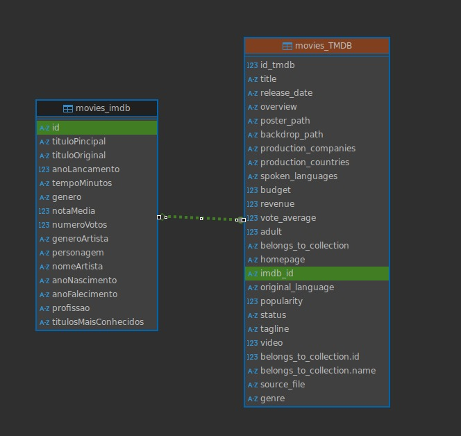
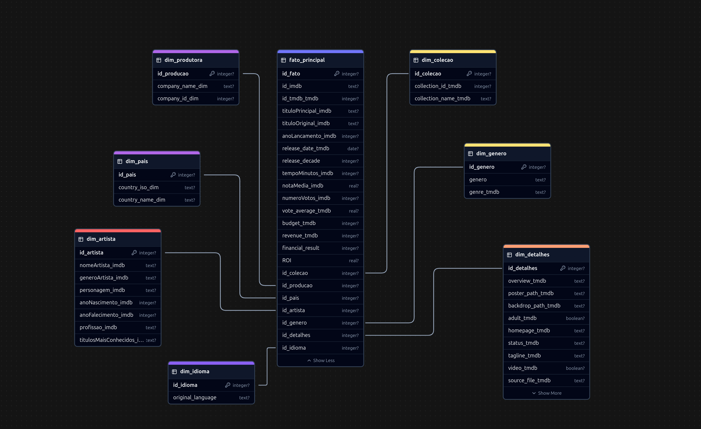
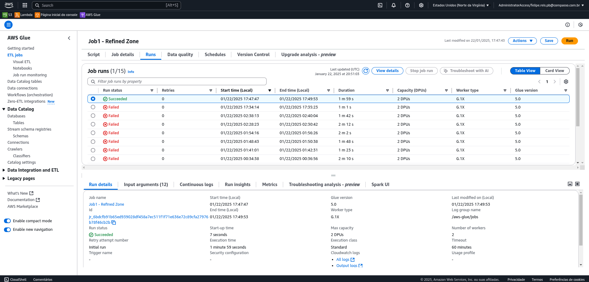
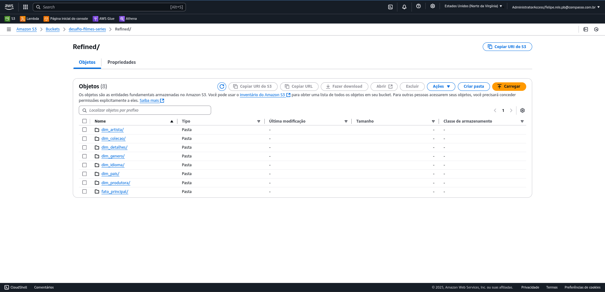
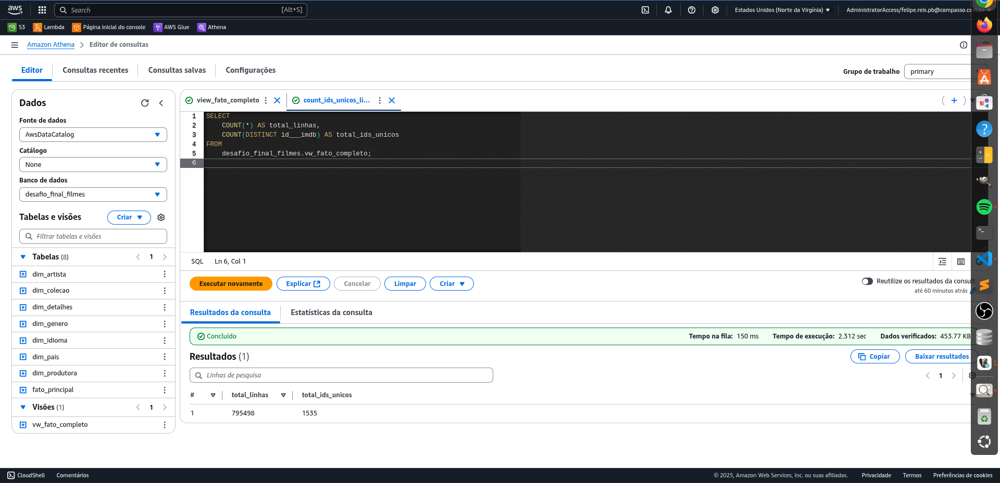
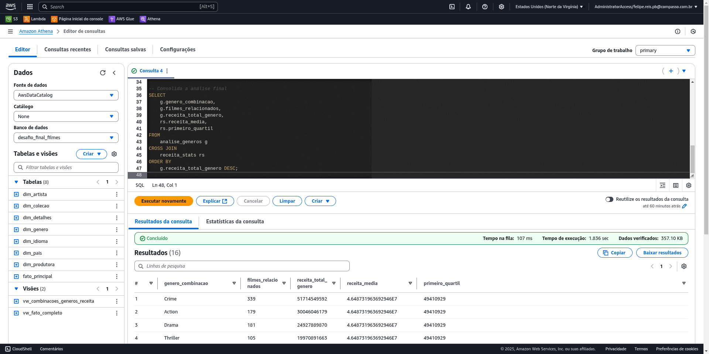

# 🎯 Objetivo
Este README documenta o progresso e as validações realizadas durante o Desafio Final do Programa de Bolsas da Compass UOL (etapa 4 de 5), com foco na Sprint 09. Nesta etapa, o objetivo principal foi persistir dados na nova **camada Refined**, que finalmente disponibiliza dados tratados, confiáveis, e estruturados (em **modelagem multi-dimensional**), para que a análise possa ser realizada.

As tecnologias utilziadas nessa sprint seguiram: o AWS Glue (com framework Spark), S3, CloudWatch e Athena, sendo os dados com origem na camada Trusted. Abaixo veremos todo percursso com mais alguns tratamentos de dados, filtros, processamento de campos calculados, para termos a melhor base possível para as análises.
<br/><br/>


# 🎮 Etapas lógicas desta sprint

## 🎭 Storytelling com dados, novas e melhores perguntas direcionadoras
Antes de mais nada, foi necessário revisitar as perguntas que estavam rascunhadas. Esta seria a última oportunidade de realizar essa revisão antes de persistir os dados na camada final, a **Refined**. Em teoria, essa camada não deveria ser alterada, apenas seus dados analisados. Portanto, foi fundamental ter uma visão clara sobre quais dados seriam incluídos nessa camada, quais ainda faltavam ser processados e quais poderiam passar por mais algum tipo de análise, tudo a partir das perguntas direcionadoras.

Aqui estavam as perguntas até, então:
``` plain text
1) Dentro do segmento `Crime/ Guerra`, quais os 10 ou 20 filmes mais votados(`numeroVotos`) e melhores votados (`notaMedia`)?

2) Destes, existe algum ator ou atriz (`nomeArtista`) que aparece em mais de um filme?

Obs: eventualmente inverter 2 e 1, para caso a amostragem seja inviável nessa disposição apresentada.

3) Destes, quais os atores/atrizes que estão vivos (`anoFalecimento`), de acordo com a base?

4) Destes, com os dados agregados do TMDB, quais são os filmes com melhor resultado (`revenue` - `budget`), ou seja que a receita cobre o orçamento?

5) Outra análise que é possível é de valor médio de orçamento x receita (ou diferença = resultado), na linha do tempo, talvez anualmente ou por décadas.
``` 

Ao explorar técnicas de **análise de dados com storytelling**, percebi a necessidade de ir além da criação de 'infográficos' que apenas reproduzem informações visíveis nas próprias tabelas, por assim dizer. Assim, busquei formular perguntas simuladas por um executivo da indústria do cinema. O objetivo não foi apenas teatralizar a apresentação dos dados, mas também simular um **ambiente empresarial**, onde perguntas são frequentemente direcionadas à área de BI. Essas perguntas têm como foco a tomada de **decisões estratégicas**, voltadas para o **desenvolvimento de novos negócios** de uma companhia, por exemplo.

## 📧 Simulação do e-mail recebido desde o cliente

De: kevin@marvelstudios.com  
Para: felipe.reis.pb@compasso.com.br

**Assunto:** Urgente: Análise de Desempenho de Filmes de Crime e Guerra

> _  
> Olá Felipe,
>
> Precisamos de uma análise detalhada sobre o desempenho de filmes dos gêneros crime e guerra. 
> Para direcionar nossa tomada de decisão, gostaria que você abordasse as seguintes questões:
>
> **Desempenho Financeiro Geral**
> - Quais combinações de gêneros entre crime e guerra geram mais receita?
> - De que maneira o orçamento impacta o ROI desses filmes?  
>
> **Popularidade e Avaliação do Público**
> - Filmes mais populares são também os mais bem avaliados?
> - Como as avaliações e a popularidade variam entre filmes de crime e guerra, incluindo suas combinações com outros gêneros?
>  
> **Franquias X Filmes Únicos**
> - Franquias são mais lucrativas do que filmes únicos no contexto de crime e guerra?
> - Como os intervalos de tempo entre lançamentos de franquias influenciam seu desempenho financeiro e de avaliação?  
>  
> **Tendências Temporais e Locais**
> - Quais décadas foram mais lucrativas para filmes de crime e guerra?
> - Existem países que se destacam na produção desses gêneros em termos de receita e avaliação?  
>  
> Gostaria que essas análises fossem apresentadas de forma visual e objetiva. A equipe executiva precisa desses insights para orientar nossas decisões sobre investimentos futuros.  
>  
> **Prazo:** até 07/fev/25.  
>  
> Att.,  
> *Kevin Feige*  
> *Marvel Studios President*  
> _

E desta forma consegui dar uma pitada de 'realidade' para as perguntas que direcionaram o restante das etapas desta sprint - e que nortearão a próxima (e última) sprint deste programa de bolsas.
<br/><br/>

## 🔎 Análise exploratória e Modelagem Relacional
Após ter as perguntas mais firmemente elaboradas, analisei os dados à disposição e compreendi que a etapa de *ingestão de dados na camada Raw* foi suficiente.

Fiz uma (bem simples!) modelagem relacional, para enxergar visualmente os dados disponíveis e como realizaria a junção destes dados.

  
*movies_imdb têm origem no arquivo `csv`fornecido, e movies_TMDB têm origem nos dados que extraí via API do TMDB, alocados nos arquivos `json`.*
<br/><br/>

## ⭐ Desenho de Modelagem Multi-dimensional (Star Schema)
Após a validação relacional - e guiado pelas perguntas - entendi quais seriam as métricas das minhas avaliações, para confecção da `Tabela Fato`; e quais outros campos seriam as demais `Dimensões` do modelo.

> ⚠️ *Nesta etapa ficou nítida a necessidade de alguns campos calculados que foram mapeados, e inseridos no desenho do Modelo Multi-dimensional, antecipadamente ao script Pyspark. Por exemplo, calculo dos campos: financial_result, ROI, release_decade, etc.*



Utilizei o script SQL abaixo, para criar as tabelas no [Sqlite Online](https://sqliteonline.com/) e posteriormente utilizei o [Chart DB](https://app.chartdb.io/) para expressar visualmente a modelagem:

```sql
-- Tabela Fato: Fato_Principal
CREATE TABLE Fato_Principal (
    id_fato SERIAL PRIMARY KEY,
    id___imdb VARCHAR(20),
    imdb_id___tmdb VARCHAR(20),
    id_tmdb___tmdb VARCHAR(20),
    tituloPincipal___imdb VARCHAR(255),
    tituloOriginal___imdb VARCHAR(255),
    title___tmdb VARCHAR(255),
    anoLancamento___imdb INT,
    release_decade INT,
    release_date___tmdb DATE,
    tempoMinutos___imdb INT,
    budget___tmdb DECIMAL(18, 2),
    revenue___tmdb DECIMAL(18, 2),
    ROI DECIMAL(10, 2),
    financial_result VARCHAR(50),
    vote_average___tmdb DECIMAL(3, 1),
    notaMedia___imdb DECIMAL(3, 1),
    numeroVotos___imdb INT,
    popularity___tmdb DECIMAL(10, 2),
    id_idioma INT,
    id_genero INT,
    id_artista INT,
    id_producao INT,
    id_colecao INT,
    id_detalhes INT,
    FOREIGN KEY (id_idioma) REFERENCES Dim_Idioma(id_idioma),
    FOREIGN KEY (id_genero) REFERENCES Dim_Genero(id_genero),
    FOREIGN KEY (id_artista) REFERENCES Dim_Artista(id_artista),
    FOREIGN KEY (id_producao) REFERENCES Dim_Produção(id_producao),
    FOREIGN KEY (id_colecao) REFERENCES Dim_Coleção(id_colecao),
    FOREIGN KEY (id_detalhes) REFERENCES Dim_Detalhes(id_detalhes)
);

-- Tabela Dimensão: Dim_Genero
CREATE TABLE Dim_Genero (
    id_genero SERIAL PRIMARY KEY,
    genero___imdb VARCHAR(100),
    main_genre___tmdb VARCHAR(100)
);

-- Tabela Dimensão: Dim_Artista
CREATE TABLE Dim_Artista (
    id_artista SERIAL PRIMARY KEY,
    nomeArtista___imdb VARCHAR(255),
    generoArtista___imdb VARCHAR(50),
    personagem___imdb VARCHAR(255),
    anoNascimento___imdb INT,
    anoFalecimento___imdb INT,
    profissao___imdb VARCHAR(100),
    titulosMaisConhecidos___imdb TEXT
);

-- Tabela Dimensão: Dim_Produção
CREATE TABLE Dim_Produção (
    id_producao SERIAL PRIMARY KEY,
    production_companies__name VARCHAR(255),
    production_companies__id VARCHAR(50),
    production_countries__iso_3166_1 VARCHAR(5),
    production_countries__name VARCHAR(100)
);

-- Tabela Dimensão: Dim_Coleção
CREATE TABLE Dim_Coleção (
    id_colecao SERIAL PRIMARY KEY,
    collection_id___tmdb VARCHAR(50),
    collection_name___tmdb VARCHAR(255)
);

-- Tabela Dimensão: Dim_Detalhes
CREATE TABLE Dim_Detalhes (
    id_detalhes SERIAL PRIMARY KEY,
    overview___tmdb TEXT,
    poster_path___tmdb VARCHAR(255),
    backdrop_path___tmdb VARCHAR(255),
    adult___tmdb BOOLEAN,
    status___tmdb VARCHAR(50),
    tagline___tmdb VARCHAR(255),
    video___tmdb BOOLEAN,
    source_file___tmdb VARCHAR(255),
    homepage___tmdb VARCHAR(255)
);

-- Tabela Dimensão: Dim_Idioma
CREATE TABLE Dim_Idioma (
    id_idioma SERIAL PRIMARY KEY,
    original_language___tmdb VARCHAR(5),
    spoken_languages__iso_639_1 VARCHAR(5),
    spoken_languages__name VARCHAR(100)
);

```
<br/><br/>

## ❇️ AWS Glue e job Spark
Nesta etapa elaborei o código abaixo que documenta cada etapa de tratamento e processamento de dados, e posteriormente a criação das tabelas conforme acima.

Em suma, o código se objetivou:
- Logging de cada etapa;
- Junção das duas tabelas do modelo relacional;
- Tratamento de células `null`, para imediato filtro com `IS NOT NULL`;
- Uso da função `explode()` para strings e arrays serem separadas em linhas;
- Inclusão de campos calculados;
- Criação das tabelas do modelo dimensional e salvamento em `parquet`distribuídos em diretórios conforme as tabelas fato e dimensões.

```python
import sys
import boto3
import logging
from pyspark.context import SparkContext
from awsglue.context import GlueContext
from awsglue.job import Job
from awsglue.utils import getResolvedOptions
from pyspark.sql.functions import col, when, explode, lit, split

def setup_logger():
    """Setup the logger for the Glue job."""
    logging.basicConfig(
        level=logging.INFO,
        format='%(asctime)s - %(levelname)s - %(message)s',
    )
    logger = logging.getLogger('GlueJobLogger')
    logger.addHandler(logging.FileHandler('/tmp/glue_job.log'))  # Local log file
    return logger

# Upload logs to S3
def upload_logs_to_s3(s3_bucket, s3_key):
    try:
        s3_client = boto3.client('s3')
        with open('/tmp/glue_job.log', 'rb') as log_file:
            s3_client.upload_fileobj(log_file, s3_bucket, s3_key)
        logger.info(f"Logs uploaded to S3: s3://{s3_bucket}/{s3_key}")
    except Exception as e:
        logger.error(f"Failed to upload logs to S3: {e}")

# Initialize logger
logger = setup_logger()

try:
    # Parse job arguments
    args = getResolvedOptions(sys.argv, ['JOB_NAME', 'LOG_BUCKET', 'LOG_KEY'])
    job_name = args['JOB_NAME']
    log_bucket = args['LOG_BUCKET']
    log_key = args['LOG_KEY']

    # Initialize Glue context
    sc = SparkContext()
    glue_context = GlueContext(sc)
    spark = glue_context.spark_session
    job = Job(glue_context)
    job.init(job_name, args)

    logger.info("Starting the Glue job: %s", job_name)

    # Action 0: Configure logging and debugging
    logger.info("Logging configured successfully.")

    # Action 1: Load data from the trusted S3 layer
    trusted_path_movies = "s3://desafio-filmes-series/Trusted/Local/Parquet/Movies/2024/12/11/"
    trusted_path_tmdb = "s3://desafio-filmes-series/Trusted/TMDB/Parquet/Movies/2024/12/27/"
    logger.info("Loading data from trusted paths.")
    movies_df = spark.read.format("parquet").load(trusted_path_movies)
    tmdb_df = spark.read.format("parquet").load(trusted_path_tmdb)

    # Action 2: Join tables
    logger.info("Joining tables on primary key.")
    joined_df = movies_df.join(tmdb_df, movies_df.id == tmdb_df.imdb_id, "inner")

    # Rename columns to add suffixes for clarity
    for col_name in movies_df.columns:
        joined_df = joined_df.withColumnRenamed(col_name, f"{col_name}___imdb")
    for col_name in tmdb_df.columns:
        joined_df = joined_df.withColumnRenamed(col_name, f"{col_name}___tmdb")

    # Action 3: Handle empty fields
    logger.info("Replacing empty fields with NULL.")
    joined_df = joined_df.select([
        when(col(c) == "", None).otherwise(col(c)).alias(c)
        for c in joined_df.columns
    ])

    # Action 4: Filter NOT NULL fields
    logger.info("Applying NOT NULL filters.")
    filtered_df = joined_df.filter(
        col("notaMedia___imdb").isNotNull() &
        col("numeroVotos___imdb").isNotNull() &
        col("id_tmdb___tmdb").isNotNull() &
        col("budget___tmdb").isNotNull() &
        col("revenue___tmdb").isNotNull()
    )

    # Validation after NOT NULL filters
    total_rows_after_filter = filtered_df.count()
    if total_rows_after_filter != 6279:
        logger.error(f"Row count validation failed after NOT NULL filters: expected 6279 rows, got {total_rows_after_filter}.")
        sys.exit(1)
    else:
        logger.info(f"Row count after NOT NULL filters is valid: {total_rows_after_filter} rows.")

    unique_ids_after_filter = filtered_df.select("id___imdb").distinct().count()
    if unique_ids_after_filter != 1556:
        logger.error(f"Unique ID validation failed after NOT NULL filters: expected 1556 unique IDs, got {unique_ids_after_filter}.")
        sys.exit(1)
    else:
        logger.info(f"Unique ID count after NOT NULL filters is valid: {unique_ids_after_filter} IDs.")

    # Action 6: Explode genres for analysis
    logger.info("Exploding genres.")
    filtered_df = filtered_df.withColumn("genero___imdb", split(col("genero___imdb"), ","))
    exploded_df = filtered_df.withColumn("genre___imdb", explode(col("genero___imdb")))

    # Action 7: Add calculated fields
    logger.info("Calculating ROI and financial result.")
    exploded_df = exploded_df.withColumn(
        "ROI", (col("revenue___tmdb") - col("budget___tmdb")) / col("budget___tmdb")
    ).withColumn(
        "financial_result", col("revenue___tmdb") - col("budget___tmdb")
    ).withColumn(
        "release_decade", (col("anoLancamento___imdb") / 10).cast("int") * 10
    )

    # Explode additional fields
        # Explode additional fields
    logger.info("Exploding additional fields.")
    exploded_df = exploded_df.withColumn("production_companies", explode(col("production_companies___tmdb")))
    exploded_df = exploded_df.withColumn("production_countries", explode(col("production_countries___tmdb")))
    exploded_df = exploded_df.withColumn("spoken_languages", explode(col("spoken_languages___tmdb")))

    # Seleção e renomeação das colunas resultantes
    exploded_df = exploded_df.select(
        col("id___imdb"),
        col("production_companies.name").alias("production_companies__name"),
        col("production_companies.id").alias("production_companies__id"),
        col("production_countries.iso_3166_1").alias("production_countries__iso_3166_1"),
        col("production_countries.name").alias("production_countries__name"),
        col("spoken_languages.iso_639_1").alias("spoken_languages__iso_639_1"),
        col("spoken_languages.name").alias("spoken_languages__name"),
        *[col(c) for c in exploded_df.columns if c not in ["production_companies", "production_countries", "spoken_languages"]]
    )

    # Final Validation after transformations
    unique_ids_final = exploded_df.select("id___imdb").distinct().count()
    if unique_ids_final != 1556:
        logger.error(f"Unique ID validation failed after transformations: expected 1556 unique IDs, got {unique_ids_final}.")
        sys.exit(1)
    else:
        logger.info(f"Unique ID count after transformations is valid: {unique_ids_final} IDs.")

    # Save tables to S3
    logger.info("Saving tables to S3.")
    exploded_df.write.partitionBy("release_decade").mode("overwrite").parquet("s3://desafio-filmes-series/Refined/Fato_Principal")

    # Save dimensional tables
    logger.info("Saving dimensional tables.")
    for dim_table, cols in {
        "Dim_Genero": ["genre___imdb"],
        "Dim_Produção": ["production_companies.name", "production_countries.name"],
        "Dim_Idioma": ["spoken_languages.name"],
    }.items():
        exploded_df.select(cols).dropDuplicates().write.mode("overwrite").parquet(f"s3://desafio-filmes-series/Refined/{dim_table}")

    logger.info("Glue job completed successfully.")
    job.commit()

    # Upload logs to S3
    upload_logs_to_s3(log_bucket, log_key)

except Exception as e:
    logger.error("An error occurred during the Glue job execution: %s", str(e))
    sys.exit(1)

``` 

Conseguimos ver pela evidência abaixo o sucesso na execução do Job e também os arquivos salvos na disposição de diretórios, tal qual das tabelas:


  

<br/><br/>

## 📡 Crawler, criação de Banco de Dados e Tabelas
Rodei o Crawler, para a criação das tabelas e disponibilização para outros serviços AWS, como o Athena.


<br/><br/>

## ⛃ AWS Athena, validações SQL e criação de Views

Para avaliar se todo o job (via Spark) e crawler foram realizados com sucesso, realizei consultas nas tabelas, no serviço `AWS Athena` - *joins* entre as tabelas, contagem de ID's únicos, etc.

Realizei algumas *VIEWS* que funcionaram como consultas testes, mas também para deixar algumas respostas às perguntas do e-mail recebido, já prontas e, finalmente, validar que atingi o objetivo da **camada Refined**.





<br/><br/>

## 📌 Considerações finais
Nesta sprint, a minha principal missão foi garantir que a `camada Refined` fosse não apenas um repositório de dados estruturados, mas uma base sólida para uma **análise profunda e estratégica**. Apesar de grande parte do trabalho ter envolvido engenharia, a modelagem de dados e o design multi-dimensional foram concebidos com um olhar atento à análise. A cada decisão tomada, como a inclusão de campos calculados e a transformação dos dados, o objetivo era sempre criar uma narrativa clara e significativa para os dados, permitindo que eles falassem por si mesmos e orientassem decisões assertivas.

Por meio de **storytelling com dados**, consegui transformar a complexidade do processo em insights diretos e estratégicos, preparados para serem consumidos pelas equipes executivas. Cada passo da jornada, desde o trabalho no AWS Glue até as validações no Athena, foi pensado para que os dados não fossem apenas entregues, mas para que pudessem **inspirar ações e decisões estratégicas**. Este trabalho, apesar de ter sido técnico em muitos aspectos, foi desenhado com a visão de um analista, garantindo que os dados pudessem contar uma história clara e impactante para os próximos passos do projeto. 🚀