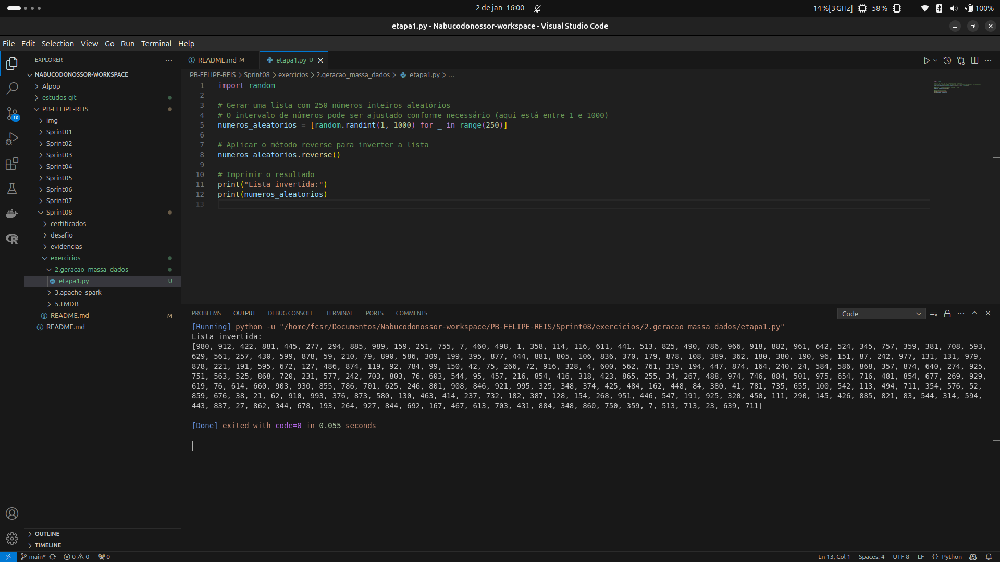
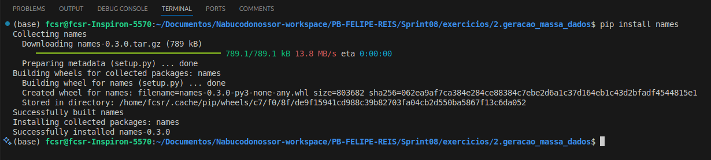
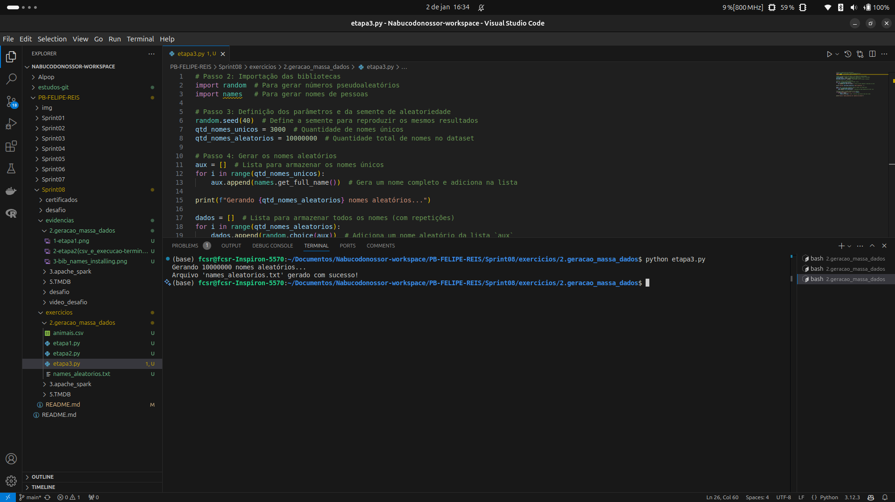
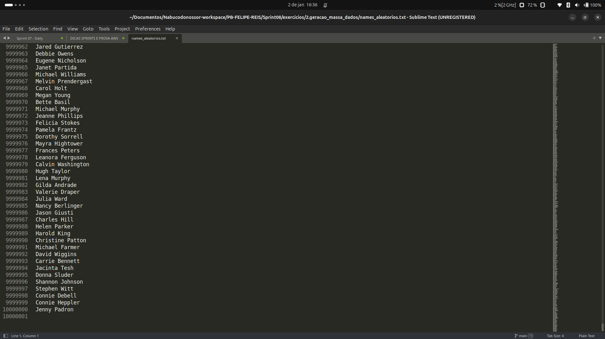

# sprint 10 - provisório .....

## 💻 Exercícios 

Nesta sprint 08, avançamos para a terceira etapa de construção do **Desafio Final do Programa de Bolsas da Compass UOL** - a etapa 3 de 5.

O foco principal nesta sprint é o uso do `Apache Spark`, explorando sua capacidade de manipulação de dados em larga escala e integração com o *Data Lake*. Entre os destaques estão o processamento distribuído e a análise avançada, utilizando tanto Python quanto SQL. Além disso, abordamos práticas otimizadas para manipulação de dados estruturados e semi-estruturados, como o uso dos formatos Parquet e CSV - além dos JSONs da última sprint -, que oferecem compactação eficiente e desempenho elevado para grandes volumes de dados.

As principais atividades dessa sprint, entre exercícios e desafio, incluem:
- Criação de datasets simulados utilizando Python e bibliotecas como random e names;
- Transformação e limpeza de dados com PySpark, explorando:
- Criação e manipulação de DataFrames;
- Operações SQL sobre dados armazenados no formato Parquet;
- Enriquecimento do DataFrame com colunas como País, Ano de Nascimento e Geração.
- Integração com o Data Lake no AWS S3, consolidando os dados manipulados em uma estrutura confiável e escalável.

Essa etapa fortalece a base para análises e visualizações futuras, garantindo um pipeline eficiente para o processamento de dados no contexto do desafio. Além disso, ajustamos o repositório Git para incluir as atualizações do exercício de extração da API TMDB, realizado na sprint anterior.

Abaixo um pouco mais dos exercícios, de forma detalhada:
<br/>

## 1 - Exercício: Geração de nomes aleatórios (com *seed*) e massa de dados 🧙‍♂️

#### Etapa 1: Aquecimento com Números Aleatórios e Lista Reversa
O exercício iniciou com a utilização da biblioteca `random` do Python, onde geramos uma sequência de números aleatórios dentro de um intervalo específico. Em seguida, para explorar a manipulação de listas, imprimimos a versão reversa dessa sequência. Esse "aquecimento" nos ajudou a familiarizar com operações simples, mas essenciais, para trabalhar com dados de forma programática.



<br/>

#### Etapa 2: Criação de um CSV com Nomes de Animais
Na segunda etapa, trabalhamos com uma lista de nomes de animais previamente criada. O objetivo foi organizar essa lista em ordem alfabética e, a partir dela, gerar um arquivo `.csv`, no qual cada linha correspondia a um animal. Essa etapa reforçou o conceito de ordenação e a prática de exportar dados em formato CSV, frequentemente usado em análises e manipulações de dados. Apesar de ainda ser parte do aquecimento, essa atividade introduziu a importância de estruturar dados para exercícios mais complexos.

.png)

<br/>

#### Etapa 3: Geração de um Arquivo TXT com Milhões de Nomes
A etapa final elevou a complexidade do exercício, exigindo a importação das bibliotecas `random` e `names`. Nosso objetivo foi gerar um arquivo `.txt` contendo milhões de registros com nomes completos. Aqui, o destaque foi o uso da função **`seed`** da biblioteca `random`. Aprendemos que, ao definir uma semente, podemos garantir a reprodutibilidade dos resultados, o que é fundamental em contextos como testes de software e replicação de cenários em diferentes ambientes. Esse aprendizado foi crucial, pois permitiu que, mesmo trabalhando com dados pseudoaleatórios, fosse possível obter sempre os mesmos resultados ao reutilizar a mesma semente. O arquivo gerado será usado no próximo exercício, envolvendo `Spark`, dando continuidade ao processo de análise em massa de dados.

Essas etapas serviram como uma introdução prática ao trabalho com dados em larga escala, estabelecendo fundamentos importantes para projetos mais avançados.





<br/>
<br/>

## 2 - Exercício: Apache Spark ✨✨

Este código, desenvolvido com `PySpark`, buscou processar dados de nomes aleatórios gerados no exercício anterior e enriquecer essas informações com a atribuição de países, anos de nascimento, e gerações correspondentes. O objetivo final foi realizar uma análise agregada que demonstra a distribuição de pessoas por país e geração, utilizando técnicas de manipulação de dados, funções python e consultas SQL no ambiente Spark.

O exercício foi realizado em 10 etapas com códigos que foram se acumulando em funcionalidades, e eventualmente reproduzindo a mesma consulta em python ou SQL, tendo o mesmo SEED e portanto o mesmo resultado de consulta.

Aqui abaixo vamos explorar de forma fragmentada o último código da 10a. etapa, que portanto, compreende todas as etapas anteriores - afim de otimizar esta documentação.

#### Configuração Inicial e Preparação do Ambiente
O primeiro passo foi importar as bibliotecas necessárias, com destaque para `SparkSession` e expr do módulo `pyspark.sql.functions`. A configuração da variável `SEED` garantiu a reprodutibilidade dos resultados, assegurando que as operações pseudoaleatórias pudessem ser replicadas de forma idêntica. A `SparkSession` foi inicializada para executar operações distribuídas, configurando o ambiente de processamento local com todos os núcleos disponíveis - que no meu ambiente local são 4 núcleos reais e mais 4 virtuais.

```python
# Importando as bibliotecas necessárias
from pyspark.sql import SparkSession
from pyspark.sql.functions import expr

# Configurando a seed para garantir reprodutibilidade
SEED = 42

# Inicializando a SparkSession
spark = SparkSession.builder \
    .master("local[*]") \
    .appName("Laboratório Etapa 10 - Pessoas por País e Geração") \
    .getOrCreate()
```
<br/>

#### Carregamento e Estruturação dos Dados
Em seguida, o arquivo `names_aleatorios.txt` foi carregado em um *DataFrame*, com a coluna de nomes renomeada para "nome". A lista de países da América do Sul foi fornecida para ser usada como base na atribuição de nacionalidades fictícias. A escolha desses países serviu para criar uma narrativa regional, tornando o conjunto de dados mais diversificado.

```python
# Carregando o arquivo names_aleatorios.txt no DataFrame
df_nomes = spark.read.text("names_aleatorios.txt").withColumnRenamed("value", "nome")

# Lista de países fornecida
paises = [
    "Argentina", "Bolívia", "Brasil", "Chile", "Colômbia",
    "Equador", "Guiana", "Paraguai", "Peru", "Suriname",
    "Uruguai", "Venezuela", "Guiana Francesa"
]
```
<br/>

#### Enriquecimento dos Dados: Países e Anos de Nascimento
A coluna país foi adicionada ao *DataFrame* de forma pseudoaleatória, utilizando a função `rand()` em combinação com o `SEED`. Isso garantiu uma distribuição uniforme e consistente dos países ao longo dos registros. Em seguida, foi gerada a coluna ano_nascimento, com valores variando entre 1945 e 2010, simulando uma população de diferentes faixas etárias. Esses valores foram calculados com base em um intervalo controlado, introduzindo diversidade temporal no conjunto de dados.

```python
# Adicionando a coluna 'pais' de forma aleatória baseada no seed
df_nomes = df_nomes.withColumn(
    "pais",
    expr(f"CASE MOD(CAST(rand({SEED}) * {len(paises)} AS INT), {len(paises)}) " +
         "WHEN 0 THEN 'Argentina' WHEN 1 THEN 'Bolívia' WHEN 2 THEN 'Brasil' " +
         "WHEN 3 THEN 'Chile' WHEN 4 THEN 'Colômbia' WHEN 5 THEN 'Equador' " +
         "WHEN 6 THEN 'Guiana' WHEN 7 THEN 'Paraguai' WHEN 8 THEN 'Peru' " +
         "WHEN 9 THEN 'Suriname' WHEN 10 THEN 'Uruguai' WHEN 11 THEN 'Venezuela' " +
         "ELSE 'Guiana Francesa' END")
)

# Adicionando a coluna 'ano_nascimento' com valores pseudoaleatórios entre 1945 e 2010
df_nomes = df_nomes.withColumn(
    "ano_nascimento",
    expr(f"CAST(1945 + FLOOR(rand({SEED}) * 66) AS INT)")
)
```
<br/>

##### Classificação por Geração
Com a coluna de anos de nascimento definida, foi criada a coluna geracao, categorizando os dados em quatro grupos etários amplamente reconhecidos: Baby Boomers, Geração X, Millennials e Geração Z. Essa classificação foi baseada em critérios históricos, refletindo mudanças demográficas e culturais entre os períodos, numa simulação da massa de dados.

```python
# Adicionando a coluna 'geracao' com base no ano de nascimento
df_nomes = df_nomes.withColumn(
    "geracao",
    expr("""
        CASE
            WHEN ano_nascimento BETWEEN 1945 AND 1964 THEN 'Baby Boomers'
            WHEN ano_nascimento BETWEEN 1965 AND 1979 THEN 'Geracao X'
            WHEN ano_nascimento BETWEEN 1980 AND 1994 THEN 'Millennials'
            ELSE 'Geracao Z'
        END
    """)
)
```
<br/>

#### Análise com Spark SQL
O *DataFrame* foi registrado como uma tabela temporária chamada nomes, permitindo que consultas `SQL` fossem realizadas diretamente sobre os dados. A consulta principal agrupou as informações por país e geração, contabilizando o número total de registros em cada combinação. A ordenação por país, geração e total possibilitou uma apresentação clara e organizada dos resultados.

``` python
# Registrando o DataFrame como uma tabela temporária
df_nomes.createOrReplaceTempView("nomes")

# Consultando o número de pessoas por pais e geracao usando Spark SQL
resultado = spark.sql("""
    SELECT pais, geracao, COUNT(*) AS total
    FROM nomes
    GROUP BY pais, geracao
    ORDER BY pais ASC, geracao ASC, total ASC
""")
```

<br/>

#### Apresentação dos Resultados
Após realizar a consulta, o número total de combinações foi contado, e os resultados foram exibidos integralmente. Essa etapa serviu para validar a análise, garantindo que todos os dados processados fossem apresentados de forma detalhada. O uso do método `show()` facilitou a visualização das combinações de países e gerações, oferecendo *insights* claros sobre a distribuição da população simulada.

``` python
# Contando o número total de linhas no resultado
num_linhas = resultado.count()

# Exibindo todos os resultados
print(f"Exibindo todas as combinações de países e gerações (total de {num_linhas} linhas):")
resultado.show(num_linhas, truncate=False)
```

<br/>
<br/>

## 3 - Exercício: Extração de dados da API TMDB 🤖
Este exeercício foi resolvido na sprint 07, e devidamente copiado no repositório conforme instrução.

[Aqui está o código gerado para esta extração](../Sprint08/exercicios/5.TMDB/script.py), lembrando que foi utilizado um arquivo e biblioteca `.env`, como boa prática de não exibir senhas e tokens no código - e por conseguinte, incluído no `.gitignore` da pasta. 
<br/>
<br/>  

# 📜 Certificados
Nesta sprint 08, não houve nenhum curso obrigatório com disponibilização de certificados.
<br/>  
<br/>  
  
# 🧠 Desafio
#### Camada Trusted: Transformação e Integração de Dados no Data Lake  

Nesta etapa do desafio, o foco principal é a criação de uma **camada Trusted** no *Data Lake*, utilizando o `AWS Glue` para processar e transformar dados provenientes de diferentes fontes. O objetivo é garantir que os dados estejam limpos, confiáveis e prontos para análises em ferramentas como o `AWS Athena`.

A abordagem envolve o uso de `Apache Spark` no Glue para desenvolver *jobs* que consolidam os dados da **camada Raw** em um formato padronizado e escalável, persistido num *bucket* do `AWS S3`. Com essa estrutura, o *Data Lake* será fortalecido para suportar consultas e visualizações otimizadas nas próximas fases do projeto.

[Confira o 'readme' do desafio aqui!](../Sprint08/desafio/README.md)