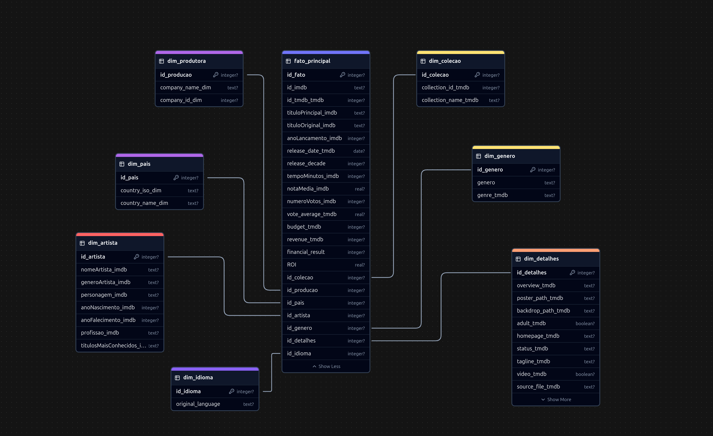
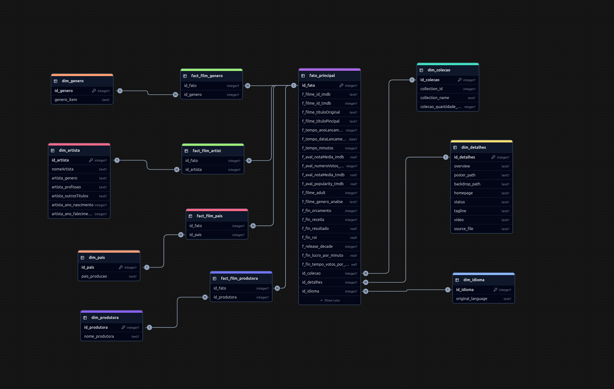
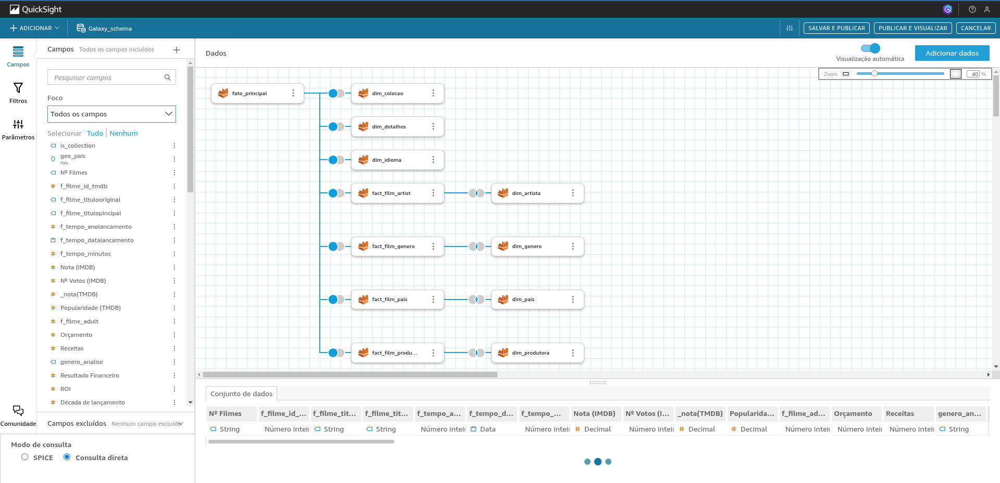
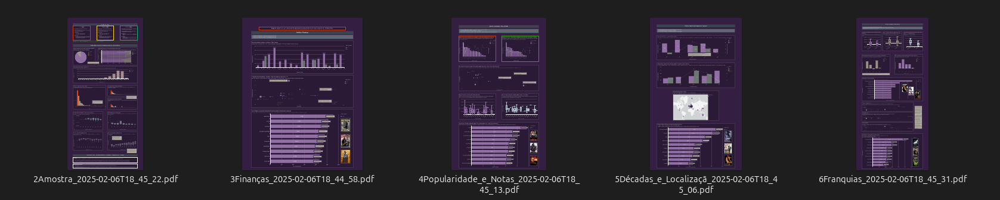

# Sprint 10 - Desafio Final - Encerramento do Programa de Bolsas

## 🎯 Objetivo
Este README documenta o progresso alcançado na **Sprint 10**, a última etapa do **Desafio Final do Programa de Bolsas da Compass UOL**. O foco principal foi a **finalização do pipeline de dados** e a **construção de dashboards estáticos** no **Amazon QuickSight** para análise dos dados de filmes e séries extraídos da API do TMDB, juntamente com dados do IMDB.

Durante a construção inicial dos dashboards no QuickSight, foram identificadas **inconsistências na contagem de alguns dados**, o que levou à necessidade de **refazer a modelagem**. A solução foi migrar de um **esquema estrela** para um **esquema Galaxy**, com **tabelas ponte**, garantindo maior precisão nos cálculos e relações entre os dados.

---

## ✍ Escopo das atividades

### 1️⃣ Identificação e Correção de Inconsistências na Modelagem

- Ao iniciar a construção dos dashboards, observou-se que os valores calculados apresentavam diferenças inesperadas, especialmente nas contagens de registros relacionados a filmes, gêneros e atores.
- A modelagem anterior, baseada em um **esquema estrela**, não estava representando corretamente os relacionamentos **muitos-para-muitos**, impactando diretamente as métricas no QuickSight.
- Para corrigir o problema, foi necessário migrar para um **esquema Galaxy**, introduzindo **tabelas ponte**, permitindo maior precisão nas análises.
 

**Modelagem ao final da sprint 09 - Star Schema**

 
**Ajuste da modelagem no início da sprint 10 - Galaxy Schema**

---

### 2️⃣ Ajuste da Modelagem no Data Lake (Refined Zone)

- A nova modelagem foi implementada com a criação de **tabelas ponte**, garantindo que os relacionamentos entre filmes, gêneros e atores fossem preservados corretamente.
- Após a reestruturação, os dados foram processados novamente e salvos no **S3**, prontos para consulta via **Athena**.
- O **AWS Glue Crawler** foi executado novamente para atualizar os metadados no **Data Catalog**, garantindo que o Athena pudesse acessar a estrutura corrigida corretamente.

### 📌 Validação no AWS Athena

- Foram executadas consultas no Athena para confirmar que as contagens estavam corretas e os relacionamentos entre as tabelas estavam consistentes após a nova modelagem.
- As análises confirmaram que a adoção do **esquema Galaxy** resolveu as discrepâncias encontradas anteriormente.

### 📌 Dashboards no QuickSight

- Os dashboards foram testados para garantir que apresentavam corretamente as métricas calculadas.
- Foram verificadas as visualizações de ranking, comparações e métricas de desempenho financeiro dos filmes.

---

### 3️⃣ Construção de Dashboards Estáticos no QuickSight

- Após a modelagem ajustada e validada, realizei a ingestão dos dados no `Amazon QuickSight` e apontei os `joins` entre as tabelas.

Foram criadas visualizações estáticas para responder às perguntas-chave do projeto, conforme veremos abaixo.

---
## 💾 Resultados Finais

O dashboard foi estruturado como um **relatório executivo**, pois, diferentemente de um dashboard dinâmico, onde filtros e interações permitem a exploração contínua dos dados, a necessidade aqui era apresentar comparações visuais diretas! Como os gráficos exigiam perspectivas muito semelhantes para construir a narrativa desejada, a abordagem estática proporcionou maior clareza ao `storytelling com dados`. Além disso, foram inseridos `boxes explicativos` ao longo do relatório para contextualizar cada visualização, garantindo que futuros consumidores dos dados compreendam plenamente os insights apresentados. Dessa forma, o material se assemelha mais a um **relatório analítico de consumo único**, oferecendo um panorama completo da análise, em vez de um dashboard tradicional, que seria acessado regularmente para monitoramento contínuo, com KPIs de uma empresa, por exemplo.

### 🏗️ Estrutura
O relatório (composto por dashboards) foi organizado da seguinte forma:

1. Índice explicativo
2. Análise Amostral (com estatística descritiva básica)
3. Anaĺises:  
    - Finanças
    - Avaliações e Popularidade
    - Tendência Temporal e Geográfica
    - Filmes únicos x Franquias
4. Conclusões e recomendações acionáveis

### 📈 Sobre os recursos estatísticos utilizados

Utilizei os **recursos fundamentais da estatística descritiva**, pois são aqueles que domino no momento. Embora tivesse o desejo de aprofundar a análise dos `outliers` (inferiores) para um estudo mais completo, a abordagem adotada — desconsiderando esses valores extremos — se mostrou uma escolha segura para garantir uma **análise consistente e confiável**, ainda que potencialmente menos abrangente.  

A identificação de padrões em métricas avaliativas e financeiras foi suficiente para extrair **insights relevantes e recomendações fundamentadas**. Embora modelos preditivos fossem uma possibilidade, considerei que não se encaixavam bem no escopo deste projeto, dado o perfil dos dados analisados. Por fim, a construção das análises teve intencionalmente um viés de geração de `recomendações acionáveis`, alinhando-se à premissa de que **dados devem sempre ser utilizados com um propósito claro e aplicável**.
 
 
### 🎥 Versão final do Relatório Executivo / Dashboards

Neste link é possível [acessar o relatório consolidado](../desafio/relatorio/Felipe.Reis-Relatório-Dashboard-Sprint10.pdf) em `pdf`.

 

## Retrospectiva do Programa de Bolsas - Compass UOL

## 📌 Jornada de Aprendizado e Evolução Técnica

Ao ingressar no **Programa de Bolsas da Compass UOL**, minha experiência com **dados e computação em nuvem** era limitada, e muitos conceitos essenciais ainda eram desconhecidos para mim. A trilha do programa foi estruturada em **10 sprints**, abordando desde os fundamentos até práticas avançadas em **Data & Analytics na AWS**, permitindo uma evolução progressiva e consolidada. Iniciei com **Linux, Git e SQL**, ferramentas essenciais para manipulação e versionamento de dados, passando por **Python** e **estatística descritiva**, fundamentais para a construção de pipelines e análises estruturadas. Em seguida, fui introduzido a conceitos de **Big Data e processamento distribuído**, aprendendo a utilizar **Apache Spark e AWS Glue** para manipulação eficiente de grandes volumes de dados. Ao longo da jornada, aprimorei habilidades em **modelagem de dados**, desde o **esquema estrela** até a estruturação de um **esquema Galaxy**, garantindo maior integridade e precisão analítica.

Na fase final do programa, consolidei conhecimentos em **visualização de dados** e **storytelling com dados**, utilizando o **Amazon QuickSight** para a construção de dashboards. O desafio exigiu não apenas a aplicação de conceitos técnicos, mas também a compreensão da **melhor forma de comunicar insights**, garantindo que os dados fossem interpretáveis e acionáveis. Além do domínio de ferramentas, a experiência proporcionou uma visão estratégica sobre **governança de dados, segurança e boas práticas em nuvem**, preparando-me para enfrentar desafios reais do mercado. Hoje, saio do programa não apenas com um profundo conhecimento em **Data & Analytics na AWS**, mas também com a confiança para aplicar essas tecnologias em projetos complexos, transformando dados em valor para o negócio.🚀